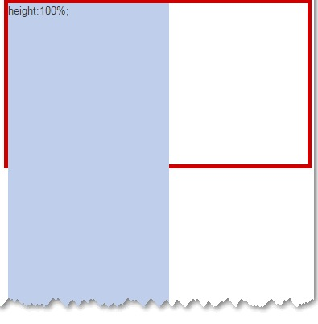
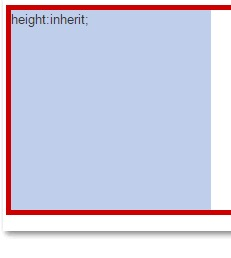

## 两者区别

- CSS

```
  .outer{
    display:inline-block;
    height:200px;
    width:40%;
    border: 5px solid #cd0000;
  }
  .height-100 {
    position:absolute;
    height:100%;
    width:200px;
    backgroud-color:#beceeb;
  }
  .height-inherit {
    position:absolute;
    height:inherit;
    width:200px;
    backgroud-color:#beceed;
  }
```


- HTML:

```
<div class="outer"><div class="height-100"></div></div>
<div class="outer"><div class="height-inherit"></div></div>
```

效果:

- 结果，height:100%的冲破云霄，哦，不对，是深入地狱：



- 而height:inherit却完美高度自适应没有定位特性的父级元素：


