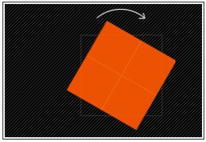
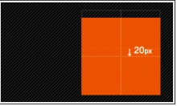
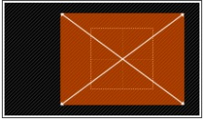
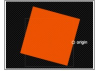
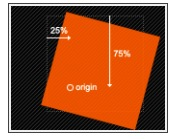
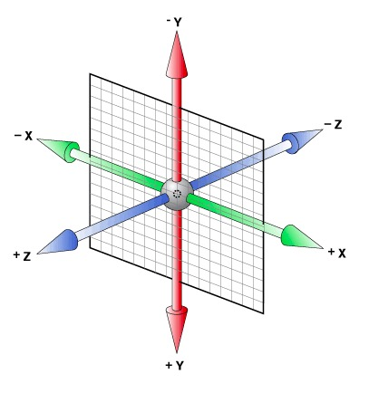
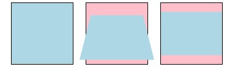
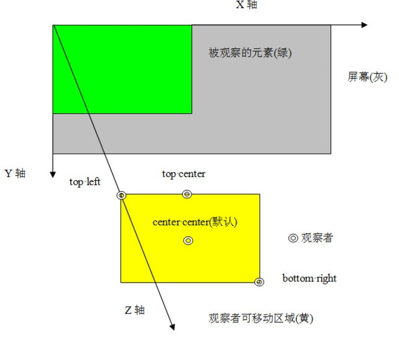
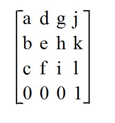
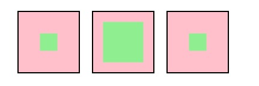

# transform

- transform 字面上就是变形，改变的意思。在css3中transform主要包括以下几种：旋转rotate,扭曲skew,缩放scale和移动translate以及矩阵变形matrix.  

##### 语法

```
  transform : none | <transform-function> [transform-function]*
  也就是：
  transform : rotate | scale | skew | translate | matrix;
```

none : 表示不进行变换；<transform-function> 表示一个或多个变换函数，以空格分开；换句话说就是我们同时对一个元素进行transform的多种属性操作，  
例如rotate,scale,translate三种，但这里需要提醒大家的，以往我们叠加效果都是用逗号（“，”）隔开，但transform中使用多个属性时需要有空格隔开  

transform属性实现了一些可用svg实现的同样的功能。它可以用于内联(inline)元素和块级(block)元素。它允许我们旋转，缩放和移动元素，他有几个属性值  
参数：rotate;translate;scale;skew;matrix;

#### 旋转rotate

rotate(<angle>): 通过指定的角度参数对原元素指定一个2D rotation(2D旋转),需先有transform-origin属性的定义  
transform-origin 定义的事旋转的基点，其中angle是指旋转角度，如果设置的值为正数表示顺时针旋转，如果设置的值为负数，则表示逆时针旋转  
如：transform:rotate(30deg)



#### 移动translate

移动translate我们分为三种情况：translate(x,y)水平方向和垂直方向同时移动(也就是X轴和Y轴同时移动)；translateX(x)仅水平方向移动(X轴移动);  
translateY(y)仅垂直方向移动(Y轴移动),具体方法是如下：  

1. translate(<translate-value>,[translate-value]):通过矢量[tx,ty]指定一个2D translation,tx是第一个过渡值参数，ty是第二个过渡值参数  
选项。如果未被提供，则ty以0作为其值。也就是translate(x,y),它表示对象进行平移，按照设定的x,y参数值，当值为负数时，反向移动物体，其基点默认为  
元素中心点，也可以根据transform-origin进行改变基点。如transform:translate(100px,20px):  


2. translateX(<translation-value>): 通过给定一个X方向上的数目指定一个translation.只向x轴进行移动元素，同样其基点是元素中心点，也可以根据  
transform-origin 改变基点位置。如:transform:translateX(100px):


3. translateY(<translation-value>) ：通过给定Y方向的数目指定一个translation。只向Y轴进行移动，基点在元素心点，可以通过transform-origin  
改变基点位置。如：transform:translateY(20px):  



##### 缩放scale

缩放scale和移动translate是极其相似，它也有三种情况:  

```
  scale(x,y) 使元素水平方向和垂直方向同时缩放
  scaleX(x)  使元素仅水平方向缩放
  scaleY(y)  使元素仅垂直方向缩放

  但它们具有相同的缩放中心点和基数，其中心点就是元素的中心点，缩放基数为1，如果其值大于1就放大，反之其值小于1，元素就缩小
```

1. scale(<number>[,<number>]):提供执行[sx,sy]缩放矢量的两个参数2D scale(2D缩放).如果第二个参数未提供，则取与第一个参数一样的值。  
scale(X,Y)是用于对元素进行缩放，可以通过transform-origin对元素的基点进行设置，同样基点在元素中心位置；其中X表示水平方向的缩放倍数，  
Y表示垂直方向的缩放倍数，而Y是一个可选参数，如果没有没有设置Y值，则表示X,Y两个方向的缩放倍数是一样的。并以X为准.  
如: transform:scale(2,1.5):  



2. scaleX(<number>) ： 使用 [sx,1] 缩放矢量执行缩放操作，sx为所需参数。scaleX表示元素只在X轴(水平方向)缩放元素,他的默认值是(1,1)   
，其基点一样是在元素的中心位置，我们同样是通过transform-origin来改变元素的基点。如：transform:scaleX(2):


3. scaleY(<number>) ： 使用 [1,sy] 缩放矢量执行缩放操作，sy为所需参数。scaleY表示元素只在Y轴（垂直方向）缩放元素，其基点同样是在元素   
中心位置，可以通过transform-origin来改变元素的基点。如transform:scaleY(2):


##### 扭曲skew

扭曲skew和translate,scale一样同样具有三种情况：  

```
 skew(x,y) 使元素在水平和垂直方向同时扭曲(X轴和y轴同时按一定的角度值进行扭曲变形);
 skewX(x)  使元素在水平方向扭曲变形(X轴扭曲变形)
 skewY(y)  使元素在水平方向扭曲变形(X轴扭曲变形)
```

使用方法:  

1. skew(<angle>[,<angle>]):X轴Y轴上的skew transformation(斜切变化).第一个参数对应X轴，第二个参数对应Y轴.如果第二个参数未提供，则值为0。  
也就是Y轴方向上无斜切。skew是用来对元素进行扭曲变形，第一个参数是水平方向扭曲角度，第二个参数是垂直方向扭曲角度。其中第二个参数是可选的，如果  
没有设置第二个参数，那么Y轴为0deg.同样是以元素中心点为基点，我们也可以通过transform-origin来改变元素的基点位置。  
如 transform:skew(30deg,10deg):  


2. skewX(<angle>):按给定角度沿 X轴指定一个skew transformation(斜切变换).skewX是使元素以其中心为基点，并在水平方向(X轴)进行扭曲变形  
同样通过transform-origin改变元素的基点.如transform:skewX(30deg):  


3. skewY(<angle>) ： 按给定的角度沿Y轴指定一个skew transformation（斜切变换）。skewY是用来设置元素以其中心为基点并按给定的角度在垂直方向  
（Y轴）扭曲变形。同样我们可以通过transform-origin来改变元素的基点。如：transform:skewY（10deg):  


##### 矩阵matrix

matrix(<number>, <number>, <number>, <number>, <number>, <number>):以一个含六值的(a,b,c,d,e,f)变换矩阵的形式指定一个2D变换，相当于  
直接应用一个[a b c d e f]变换矩阵。就是基于水平方向(X轴)和垂直方向(Y轴)重新定位元素，此属性值使用涉及到数学中的矩阵，这里简单说明:  

- 改变元素基点transform-origin

前面我们多次提到transform-origin这个东西，它的主要作用就是让我们在进行transform动作之前可以改变元素的基点位置，因为我们元素默认基点就是其  
中心位置。有时候我们需要在不同的位置对元素进行这些操作，那么我们就可以使用transform-origin来对元素进行基点位置改变，使元素位置不再基点位置.  
规则如下：  

transform-origin(X,Y)：用来设置元素的运动的基点（参照点）。默认点是元素中心。其中X和Y值可以是百分之,em,px,其中X也可以是字符参数值left,  
center,right; Y和X一样除了百分值外还可以设置字符值top,center,bottom,这个看上去有点像我们的background-position设置一样；  
下面列出它们相对应的写法:  

1. top left | left top 等价于 0 0 | 0% 0%
2. top | top center | center top 等价于 50% 0 
3. rigiht top | top right 等价于 100% 0
4. left | left center | center left 等价于 0 50% | 0% 50%
5. center | center center 等价于50% 50% (默认值)
6. right | right center | center right 等价于 100% 50%
7. bottom left | left bottom 等价于 0 100% | 0% 100%
8. bottom | bottom center | center bottom 等价于 50% 100%
9. bottom right | right bottom 等价于 100% 100%

其中left,center,right是水平方向取值，对应的百分值left=0%;center=50%;right=100%而top center bottom是垂直方向的取值,其中top=0%;  
center=50%;bottom=100%;如果只取一个值，表示垂直方向值不变，我们分别来看看以下几个实例  

(1) transform-origin:(left,top):


(2) transform-origin:(right):



(2) transform-origin:(25%,75%):



transform-origin并不是transform中的属性值，他具有自己的语法，下面列出各种浏览器内核下的语法规则：  


## 3D

主要属性:

> transform-origin,  
> transform,  
> transform-style,  
> perspective,  
> perspective-origin,  
> backface-visibility  

坐标轴  



### 透视 

- 透视使transform 变形3D中最重要的内容。没有透视，3D无法实现.  

下面以rotateX()旋转函数为例，rotateX(45deg)表示元素以x轴方向沿轴旋转45度  
//左图是无变形和透视样式的原始效果，中图是设置变形和透视样式的效果，右图是设置变形但未设置透视样式的效果  


  
由以上三个图可说明，如果不设置透视，那么浏览器会将元素的3D变形操作投射垂直到2D视平面上，最终呈现出来的只是元素的宽高变化  

要深入了解透视，需要观察者，被透视元素和变形元素这几个概念。  

首先变形元素，就是进行transfrom3D变形的元素，主要进行transform,transform-origin,backface-visibility等属性的设置  

观察者是浏览器模拟出来的用来观察被透视元素的一个没有尺寸的点，观察者发出视线，类似于一个点光源发出光线  

被透视元素也就是被观察者的元素，根据属性设置的不同，它有可能是变形的元素本身，也可能是它的父及或祖先元素，主要进行perspective  
,perspective-origin等属性的设置  


### 透视距离

- 透视距离perspective是指观察者沿着平行于z轴的视线与屏幕之间的距离，简称视距  


`perspective`

```
值：none | <length>
初始值：none
应用于：非inline元素(包括block,inline-block,table,table-cell等)
继承性：无

ps: 透视perspective不可为0和负数，因为贯彻着与屏幕距离为0时或者在屏幕背面时是不可以观察到被透视元素的正面的

ps: 透视perspective不可取百分比，因为百分比需要相对的元素，但z轴并没有可相对的元素尺寸
```

1. 一般的，物体离得越远，显得越小。反映在perspective属性上，就是该属性值越大，元素的3D效果约不明显。  
(就像离一个人很近，甚至可以看到他的毛孔；如果离一个人很远，可能只看到一个轮廓)  

2. 设置透视perspective属性的元素就是被透视元素。一般的，该属性只能设置在变形元素的父级或祖先级。因为浏览器会为其子级的变形产生  
透视效果，但并不会为其自身产生透视效果  

```
// 在本身元素上设置透视无效果  
<div style="float:left;margin-right: 10px;border:2px solid gray;">
    <div style="perspective: 200px;width: 100px;height: 100px;border:1px solid black;background-color: pink;transform: rotateX(45deg);">
    </div>
</div>

<!-- 在父级元素上设置透视有效果 -->
<div style="perspective: 200px; float:left;margin-right: 10px;border:2px solid gray;">
    <div style="width: 100px;height: 100px;border:1px solid black;background-color: lightblue;transform: rotateX(45deg);">
</div>

```

### 透视原点

透视原点perspective-origin是指观察者的位置，一般地，观察者位于与屏幕平行的另一个平面上，观察者始终是与屏幕垂直的。  
观察者的活动区域是被观察元素的盒模型区域.  

  

`perspective-origin`

```
值：x轴 y轴
初始值：50% 50%
应用于：非inline元素((包括block、inline-block、table、table-cell等)
继承性: 无
```

> x轴 left | right | center | <percentage> | <length>  
> y轴 top  | bottom | center | <percentage> | <length>  

1. 关键字(perspective-origin:right top)  

> x轴 :  left 0% center: 50% right:100%  
> y轴 :  top: 0% center: 50% bottom: 100%  

2. 数值(perspective-origin 40px 20px)  

> x轴数值表示在x轴上离0点(元素边框外侧左上角)的偏移量；y轴数值表示在y轴上离0点的偏移量  

3. 百分比 (perspective-origin -50% 20%)  

> 其中x轴的百分比相对于被透视元素的宽度和(width+横向padding+横向border),  
> 而y轴的百分比相对于被透视元素的高度和(height+纵向padding+纵向border)  

4. 单个值(当只有一个值时，默认第二个值为center)  

ps: perspective-origin必须定义在设置perspective的元素上，也就是死活必须设置在元素的父元素或祖先元素上  


## 变形函数

介绍完透视之后，接下来详细介绍关于变形函数和变形原点。3d变形函数有位移，旋转和缩放，没有倾斜  

ps: 倾斜skew()是二维变形，不能在三维空间变形，元素可能会在x轴和y轴倾斜，但不能在z轴倾斜  

####矩阵matrix3d

3d变形函数位移，旋转和缩放都是通过矩阵设置不同的参数而实现的。相比于2d矩阵martrix()  的6个参数而言，  
3d矩阵matrix3d却有12个参数。其变形规则与2dmatrix()类似，只不过是从3*3矩阵，变成了4*4矩阵  

> matrix3d(a,b,c,0,d,e,f,0,g,h,i,0,j,k,l,1)  


  
### 3d位移

3d位移函数主要包括translateZ()和translate3d()  

`ranslate3d(x,y,z)`  

ps: 其中,x和y可以是长度值，也可以是百分比，百分比是相对于其基本元素水平方向的宽度和垂直方向的高度，z只能设置长度值  

`tranlateZ(z)` 相当于(0,0,z)  
transform:matrix3d(1, 0, 0, 0, 0, 1, 0, 0, 0, 0, 1, 0, 0, 0, -60, 1)  

ps: 常用-webkit-transform: translateZ(0);来开启硬件加速  

ps: 3d位移函数相当于matrix3d(1,0,0,0,0,1,0,0,0,0,1,0,x,y,z,1)


### 3d缩放

3d缩放函数主要包括scaleZ()和scale3d()  

`scale3d(x,y,z)`  
默认值为scale3d(1,1,1),当参数为负数时，先翻转再缩放  

`scaleZ(z)`相当于scale3d(1,1,z)  

ps: 3d缩放函数相当于matrix3d(x,0,0,0,0,y,0,0,0,0,z,0,0,0,0,1)  

ps: scaleZ()和scale3d()单独使用时没有任何效果  

```
.box1 .in{
    transform: translateZ(-500px);
}
.box2 .in{
    transform: translateZ(-100px);
}
.box3 .in{
    transform: scaleZ(5) translateZ(-100px);
}
```

> //下图中从左到右分别是box1,box2,box3。由此得知，box3也相当于向z轴移动了-500px  

所以transform:scaleZ(5) translateZ(-100px)和transform:translateZ(-500px)是等价的




### 3d旋转

3d旋转函数蛀牙哦包括 rotateX(),rotateY(),rotateZ(),rotate3d()  

`ratate3d(x,y,z,Ndeg)`  

x,y,z分别用来描述围绕z,y,z轴旋转的矢量值。最终变形元素沿着由(0,0,0)和(x,y,z)这两个点构成的直线为轴，进行旋转。当N为正数时，  
元素进行顺时针旋转；当N为负数时，元素进行逆时针旋转  

ps: safari浏览器不支持keyframes中改变rotate3d()  

`rotateX(Ndeg)`  相当于rotate3d(1,0,0,Ndeg)  

`rotateY(Ndeg)`  相当于rotate3d(0,1,0,Ndeg)  

`rotateZ(Ndeg)`  相当于rotate3d(0,0,1,Ndeg)  


## 透视函数 

上面详细介绍了透视属性perspective,但透视属性应用在变形元素的父级或祖先级。而透视函数perspective()时transform变形函数的  
一个属性值，应用于变形元素本身  

ps: 由于透视原点perspective-origin只能设置在设置了perspective透视属性的元素。若为元素设置透视函数perspective(),则透视原点  
不起作用，观察者使用默认位置，即元素中心点对应的平面上  

`perspective(<length>)`  

透视函数perspective(<length>)的参数只能时长度值，长度值只能是正数  

ps: 由于transform属性是从前向后的顺序解析属性的，所以一定要把perspective()函数写在其他变形函数前面，否则将没有透视效果  

> transform:perspective(130px) rotateX(-120deg)  

### 变形原点

　2d变形原点由于没有z轴，所以z轴的值默认为0。而3d变形原点的z轴是一个可以设置的变量  

`transform-origin`

```
值：x轴 y轴 z轴
初始值 50% 50%
应用于：非inline元素(包括block、inline-block、table、table-cell等)
继承性：无
```

ps: IE9-浏览器不支持，safari3.1-8、android2.1-4.4.4、IOS3.2-8.4都需要添加前缀，其他更高版本浏览器可使用标准写法  

对于x轴和y轴来说，可以设置关键字和百分比，分别相对于其本身元素水平方向的宽度和垂直方向的高度和；z只能设置长度值  

//变形元素默认样式是 transform:rotate3d(1,1,1,45deg);  

### 背景可见 

元素的背面默认是可见的。但有时需要让元素背面不可见，这就要用到属性backface-visibility  

`backface-visibility`: 设置元素背面是否可见  

> visible:可见，默认  
> hidden:不可见  
 
//设置一个元素包含两个半透明子元素绝对定位重叠，内容分别为A和B，来表示一个元素的正面和背面  

ps：若一个元素覆盖于另一个元素上，不仅仅是正面覆盖，背面也是覆盖的  

### 变形风格

变形风格transform-style 允许变形元素及其子元素在3d空间中呈现。变形风格由=有两个值。flat是默认值，表示2d平面  
而perserve-3d表示3d空间  

ps: 当设置了overflow:非visible或clip:非auto时，transform-style:perserve-3d失效  

> transform-style:flat | preserve-3d  
