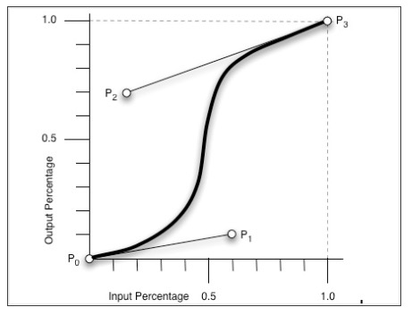
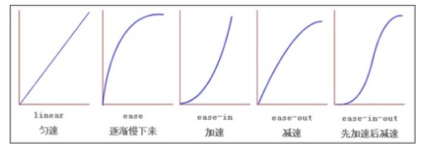
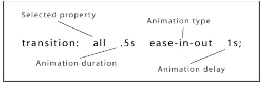

# transition :

-  css的transition允许css的属性值在一定的时间区间内平滑地过渡。这种效果可以在鼠标单击，获得焦点，被电击或对元素任何改变中触发，并圆滑地以动画效果改变css的属性值.  

transition主要包含四个属性值：  

> transition-property:执行变换的属性  
> transition-duration:变换延续的时间  
> transition-timing-function:在延续时间段，变换的速率变化  
> transition-delay:变换延迟的时间  

##### transition-property:

```
transition-property : none | all | [ <IDENT> ] [',' <IDENT>]*
```


transition-property是用来指定当元素其中一个属性改变时执行transition效果,其主要有以下几个值:  

```
  none: 没有属性改变
  all:所有属性改变，这个事默认值
  ident:元素属性名
```

```
  当其值为none时，transition马上停止执行，当指定为all时,则元素产生任何属性值变化时都将执行transition效果，
  ident是可以指定元素的某个属性值。其对应的类型如下:

  1.color:通过红，绿，蓝和透明度组件变换（每个数值处理）如：background-color,border-color,color,outline-color等属性；

  2.length:真实的数字类型 如：word-spacing,width,vertical-align,top,right,bottom,left,padding,outline-width,
  margin,min-width,min-height,max-width,max-height,line-height,height,border-width,border-spacing,
  background-position等属性；

  3.percentage:真实的数字 如： word-spacing,width,vertical-align,top,right,bottom,left,min-width,min-height,max-width,max-height,line-height,height,background-position等属性；

  4.integer离散步骤（整个数字），在真实的数字空间，以及使用floor()转换为整数时发生 如：outline-offset,z-index等属性；

  5.number 真是的(浮点型)数值，如：zoom,opacity,font-weight等属性

  6.transform list: ...

  7.reatangle:通过x,y,width和height(转为数值)变换，如：crop

  8.visibility:离散步骤，在0道1数字范围之内，0表示“隐藏”，1表示完全“显示”，如visibility

  9.shadow:作用于color,x,y和blur(模糊)属性，如：text-shadow

  10.gradient:通过每次停止时的位置和颜色进行变化。它们必须有相同的类型（放射状的或是线性的）和相同的停止数值以便执行动画
  如：background-image

  11.paint server(SVG):只支持下面的情况：从gradient到gradient以及color到color,然后工作与上面类似

  12.space-separanted list of above:如果列表有相同的项目数值，则列表每一项按照上面的规则进行变化，否则无变化

  13.a shorthand property:如果缩写的所有部分都可以实现动画，则会像所有单个属性变化一样变化
```

ps: 并不是什么属性改变都为触发transition动作效果，比如页面的自适应宽度，当浏览器改变宽度时，并不会触发transition的效果。

##### transition-duration:

```
   transition-duration ： <time> [, <time>]* 
```

transition-duration 是用来指定元素转换过程的持续时间，取值：<time>为数值，单位为s(秒)或者ms(毫秒),可以作用于所有元素,   
包括:before和:after伪元素。其默认值是0,也就是变换时是及时的。

##### transition-timing-function:

```
    transition-timing-function ： ease | linear | ease-in | ease-out | ease-in-out | cubic-bezier(<number>, <number>, <number>, <number>) [, ease | linear | ease-in | ease-out | ease-in-out | cubic-bezier(<number>, <number>, <number>, <number>)]* 
```

transition-timing-function的值允许你根据时间的推进去改变属性值的变换速率，transition-timing-function有6个可能值：  

```
  1.ease:(逐渐变慢)默认值，ease函数等同于贝塞尔曲线(0.25,0.1,0.25,1.0)

  2.linear:(匀速)，linear函数等同于贝塞尔曲线(0.0,0.0,1.0,1.0)

  3.ease-in:(加速),ease-in函数等同于贝塞尔曲线(0.42,0,1.0,1.0)

  4.ease-out:(减速),ease-out函数等同于贝塞尔曲线(0,0,0.58,1.0)

  5.ease-in-out:(加速然后减速)，ease-in-out函数等同于贝塞尔曲线(0.42,0,0.58,1.0)

  6.cubic-bezier:(该值允许你去自定义一个时间曲线)，特定的cubic-bezier曲线。(x1,y1,x1,y2)四个值特定于曲线上点P1和点P2.所有值需在
  [0,1]区域内，否则无效。
```

其中cubic-bezier为通过贝塞尔曲线来计算“转换”过程中的属性值，如下曲线所示，通过改变(x1,y1)和(x2,y2)的坐标可以改变整个过程的  
Output Percentage.初始默认值为default.  



其他几个属性的示意图：   




##### transition-delay:

```
transition-delay: <time> [,<time>]*
```

```
  transition-delay是用来指定一个动画开始执行的时间，也就是说当改变元素属性值多长时间开始执行transition效果,其取值：
  <time>为数值，单位为s(秒) 或者ms(毫秒),其使用和transition-duration极其相似，也可以作用于所有元素,包括:before和:after伪元素.
  默认大小是"0",也就是变换立即执行，没有延迟.


```

有时我们不只改变一个css效果的属性,而是想改变两个或者多个css属性的transition效果，那么我们只要把几个transition的声明串在一起，  
用逗号（“，”）隔开 然后各自可以有各自不同的延续时间和其时间的速率变换方式。但需要值得注意的一点：transition-delay与  
transition-duration的值都是时间。所以要区分它们在连写中的位置，一般浏览器会根据先后顺序决定，第一个解析为时间的必须为   
transition-duration 第二个为transition-delay.如:

```
  a {
    -moz-transition: background 0.5s ease-in,color 0.3s ease-out
    -webkit-transition: background 0.5s ease-in,color 0.3s ease-out; -o-transition: background 0.5s ease-in,color 0.3s ease-out; transition: background 0.5s ease-in,color 0.3s ease-out;
  }
```

如果你想给元素执行所有transition效果的属性，那么我们还可以利用all属性值来操作，此时他们共享同样的延续时间及速率变换方式，如  

```
  a {
    -moz-transition: all 0.5s ease-in;
    -webkit-transition: all 0.5s ease-in;
    -o-transition: all 0.5s ease-in; 
    transition: all 0.5s ease-in;
  }
```

综合上述我们可以给transition一个速记法：transition:<property><duration><animation type><delay>如下图所示：



相对应的一个示例代码：  

```
  p {
    -webkit-transition : all .5s ease-in-out 1s;
    -o-transition: all .5s ease-in-out 1s; 
    -moz-transition: all .5s ease-in-out 1s; 
    transition: all .5s ease-in-out 1s;
  }
```
