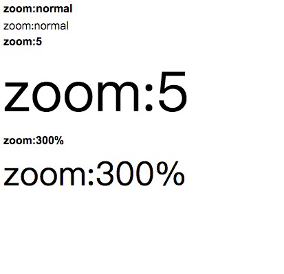

# 目录

- [基础](#基础)

# 基础

- 允许对长单词进行拆分，并换行到下一行：  

```
  ...
  <div className='css'>
     This paragraph contains a very long word: thisisaveryveryveryveryveryverylongword. The long word will break and wrap to the next line.
  <div>
  ...

  .css {
    width:11em; 
    border:1px solid #000000;
    word-wrap:break-word;
  }

```

- background-size 属性规定背景图片的尺寸。  

```
  ...
  <p className='css'></p>
  <p>上面是缩小的背景图片。</p>

  <p>原始图片：</p>
  ...

  .css {
    background:url(../../assets/img/login.logo@2x.png);
    background-size:63px 100px;
    -moz-background-size:63px 100px; /* 老版本的 Firefox */
    background-repeat:no-repeat;
    padding-top:80px;
  }

  属性：

  length: 设置背景图片的高度和宽度. 第一个值设置宽度，第二个值设置高度。如果只设置一个值，则第二个值会被设置为"auto"。
  percentage : 百分比，同上.
  cover : 把背景图像扩展至足够大，以使背景图像完全覆盖背景区域。背景图像的某些部分也许无法显示在背景定位区域中.
  contain : 把图片图像扩展至最大尺寸，以使其宽度和宽度完全适应内容区域。

```

- content-box 中定位背景图片:  

``` 
  ...
  <div className='css'>
    这是文本。这是文本。这是文本。这是文本。这是文本。这是文本。这是文本。这是文本。这是文本。这是文本。这是文本。这是文本。这是文本。这是文本。这是文本。这是文本。这是文本。这是文本。这是文本。这是文本。这是文本。这是文本。这是文本。这是文本。这是文本。这是文本。这是文本。这是文本。这是文本。这是文本。这是文本。这是文本。这是文本。这是文本。这是文本。这是文本。
  </div>
  ...

  .css {
    background:url(bg_flower.gif);
    background-repeat:no-repeat;
    ackground-size:100% 100%;
    -webkit-background-origin:content-box; /* Safari */
    background-origin:content-box; 
  }
```

- 为div 元素设置两幅背景图片:  

```
  ...
  <div className='css'>
  </div>

  ...

  .css{
    background-image:url(bg_flower.gif),url(bg_flower_2.gif);
  }

```

- 向标题添加阴影  

```
  ...
  <div className='css'>
    文本阴影效果
  </div>
  ...

  .css {
    text-shadow:5px 5px 5px #ff0000;
  }
```

-  2D 转换方法  

```
  ...
  <div className='css'>
    Hello World
  </div>
  ...

  .css{
    margin:30px;
    width:200px;
    height:100px;
    background-color:yellow;
    transform:rotate(9deg);
  }
```

- 通过 scale() 方法，元素的尺寸会增加或减少，根据给定的宽度（X 轴）和高度（Y 轴）参数  

```
  ...
  <div className='css'>
    Hello World
  </div>
  ...

  .css{
    margin:30px;
    width:200px;
    height:100px;
    background-color:yellow;
    transform:scale(2,4);
  }
```

- 设置 class 属性值包含 "test" 的所有 div 元素的背景色  

```
...
<div className="animation">
  <div className="first_test">第一个 div 元素。</div>
  <div className="second">第二个 div 元素。</div>
  <div className="test">第三个 div 元素。</div>
  <p className="test">这是段落中的文本。</p>
</div>

...

.animation{
  div[class*="test"]{
    background: #ffff00;
  }
}

```

- 设置 class 属性值以 "test" 开头的所有元素  

```
 ...
<div className="animation">
  <div className="first_test">第一个 div 元素。</div>
  <div className="second">第二个 div 元素。</div>
  <div className="test">第三个 div 元素。</div>
  <p className="test">这是段落中的文本。</p>
</div>

...

.animation{
  [class^="test"]{
    background: #ff0000;
  }
} 
```


- 使被选中的文本成为红色  

```
...
<div className="animation">
  <div className="first_test">第一个 div 元素。</div>
  <div className="second">第二个 div 元素。</div>
  <div className="test">第三个 div 元素。</div>
  <p className="test">这是段落中的文本。</p>
</div>

...

.animation{
  div[class*="test"]{
    background: #ffff00;
  }
}

```

- !important  优先级最高  

```
...
<div className="animation">
  <div className="first_test">第一个 div 元素。</div>
  <div className="second">第二个 div 元素。</div>
  <div className="test">第三个 div 元素。</div>
  <p className="test">这是段落中的文本。</p>
</div>

...

.animation{
  div[class*="test"]{
    background: #ffff00;
    background: #ff0000 !important; //优先  
  }
}
```

- 规定段落中的文本不进行换行：  

```
  white-space: nowrap
```

- 设置旋转元素的基点位置 transform-origin ：   

```

<div className="animation">
  
</div>

...

div

  {
  transform: rotate(45deg);
  transform-origin:20% 40%;

  -ms-transform: rotate(45deg);     /* IE 9 */
  -ms-transform-origin:20% 40%;     /* IE 9 */

  -webkit-transform: rotate(45deg); /* Safari 和 Chrome */
  -webkit-transform-origin:20% 40%; /* Safari 和 Chrome */

  -moz-transform: rotate(45deg);    /* Firefox */
  -moz-transform-origin:20% 40%;    /* Firefox */

  -o-transform: rotate(45deg);    /* Opera */
  -o-transform-origin:20% 40%;    /* Opera */
}
```

- backgroud-size: length|percentage|cover|contain

```
length              设置背景图像的高度和宽度
                    第一个设置宽度，第二个值设置高度
                    如果只设置一个值，则第二个值会被设置为"auto"
```

```
percentage          以父元素的百分比来设置背景图像的宽度和高度.
                    第一个设置宽度，第二个值设置高度
                    如果只设置一个值，则第二个值会被设置为"auto"
```

```
cover               把背景图像扩展至足够大，以使背景图像完全覆盖背景区域。
                    背景图像的某些部分也许无法显示在背景定位区域内
```

```
contain             把图像扩展至最大尺寸，以使其宽度和高度完全适应内容区域
```

- appearance : 使div元素看上去像一个按钮  
  (normal|icon|window|button|menu|field)

`normal` 将元素呈现为常规元素  
`icon`  将元素呈现为图标(小图标)  
`window`  将元素呈现为视口  
`button`  将元素呈现为按钮  
`field`  将元素呈现为输入字段  

```
 div {
  appearance:button;
  -moz-appearance:button; /* Firefox */
  -webkit-appearance:button; /* Safari 和 Chrome */
 }
```

- box-shadow : 属性向框添加一个或多个阴影。

`语法`  box-shadow: h-shadow v-shadow blur spread color inset;  

```
h-shadow    必须。水平阴影的位置。允许负值
v-shadow    必须。垂直阴影的位置。允许负值
blur        可选。模糊距离.
spread      可选。阴影的尺寸。
color       可选。阴影的颜色。
inset       可选。将外部阴影（outset）改为内部阴影.
```

- div {
  border: 1px solid transparent; //transparent表示边框颜色透明
} 


- pointer-events :  CSS属性pointer-events允许作者控制特定的图形元素在何时称为鼠标事件的target.当未指定该属性时，SVG内容表现  
如同visiblePainted.

除了指定元素不称为鼠标事件的目标，none值还指示鼠标事件穿过该元素，并指向位于元素下面的元素.  

#### 语法:

```
pointer-events: auto | none | visiblePainted | visibleFill | visibleStroke | visible | painted | fill | stroke | all | inherit
```

###### 值

auto: 与pointer-events属性未指定时的表现效果相同，对于SVG内容，该值与visiblePainted效果相同  

none: 元素永远不会成为鼠标事件的target.但是其后代元素的pointer-events属性指定其他值时，鼠标事件可以指向后代元素，在这种情况下，  
鼠标事件将在捕获或冒泡阶段出发父元素的事件侦听器  

visiblePainted: 只适用于SVG.元素只有在以下情况才会成为鼠标事件的目标：  
  - visibility属性值为visible,且鼠标指针在元素内部，且fill属性指定了none之外的值  
  - visibility属性值为visible,鼠标指针在元素边界上，且stroke属性指定了none之外的值  

visibleFill: 只适用于SVG。只有在元素的visibility属性值为visible,且鼠标指针在元素内部时，元素才会成为鼠标事件的目标，  
fill属性的值不影响事件处理。  

visibleStroke: 指适用于SVG.只有在元素visibility属性值为visible，且鼠标指针在元素边界时,元素才会成为鼠标事件的目标，  
stroke属性的值不影响事件处理。  

visible : 只适用于SVG。只有在元素visibility属性值为visible，且鼠标指针在元素内部或边界时,元素才会成为鼠标事件的目标，  
fill和stroke属性的值不影响事件处理。  

painted : 只适用于SVG.元素挚友在以下情况才会成为鼠标事件的目标：  
  - 鼠标指针在元素内部,且fill属性指定了none之外的值  
  - 鼠标指针在元素边界上，且stroke属性指定了none之外的值  
  visibility属性的值不影响事件处理   

fill: 只适用于SVG。只有鼠标指针在元素内部时,元素才会成为鼠标事件的目标，fill和visibility属性的值不影响事件处理。  

strkoe: 只适用于SVG。只有鼠标指针在元素边界上时,元素才会成为鼠标事件的目标，stroke和visibility属性的值不影响事件处理。  

all: 只适用于SVG。只有鼠标指针在元素内部或边界时,元素才会成为鼠标事件的目标，fill、stroke和visibility属性的值不影响事件处理。  

- user-select

```
  user-select : none | text | all | element
```

> none : 文本不能被选择  
> text : 可以选择文本  
> all  : 当所有内容作为一个整体时可以被选择。如果双击或者在上下文上点击子元素，那么被选择的部分将是以该元素向上回溯的最高祖先元素  
> element: 可以选择文本，但选择范围受元素边界的约束  

- background-clip  
  规定背景的绘制区域

```
  div{
    background-color:yellow;
    background-clip:content-box;
  }
```

```
  border-box: 背景被裁剪到边框盒。
  padding-box:背景被裁剪到内边距框。
  content-box:背景被裁剪到内容框。
```

- appearance
  是div元素看上去像一个按钮(或者别的)  

```
  div {
    appearance:button;
    -moz-appearance:button; /* Firefox */
    -webkit-appearance:button; /* Safari 和 Chrome */
  }
```

-  vertical-align
  设置元素的垂直对齐方式  

```
  baseline: 默认。元素放置在父元素的基线上。
  sub: 垂直对齐文本的下标。
  super:垂直对齐文本的上标。
  top: 把元素的顶端与行中最高元素的顶端对齐
  text-top: 把元素的顶端与父元素字体的顶端对齐。
  middle: 把元素放置在父元素的中部。
  bottom : 把元素的顶部与行中最低的元素的顶端对齐。
  text-bottom:把元素的低端与父元素字体的低端对齐。
  length
  %: 使用"line-height" 属性的百分比值来排比此元素。允许使用负值。
  inherit:规定应该从父元素继承vertical-align属性的值
```

- white-space  
  设置如何处理元素内的空白  

```
  normal: 默认。空白会被浏览器忽略。
  pre: 空白会被浏览器保留。其行为方式类似HTML中的<pre>标签。
  nowrap: 文本不会换行，文本会在同一行上继续，知道遇到<br>标签为止.
  pre-wrap: 保留空白符序列，但是正常的进行换行。
  pre-line: 合并空白符序列，但是保留换行符。
  inherit: 规定应该从父元素继承white-space属性的值。
```

- CSS  initial 关键字  

```
  <div style={{color:red}}>
    <h1 style={{color:initial}}></h1>
  </div>
```

- max-width  
  设置元素的最大宽度  
  该属性值会对元素的宽度设置一个最高限制。因此，元素可以比指定值窄，但不能比其宽。不允许指定负值。  

```
  none : 默认。定义对元素的最大宽度没有限制.
  length: 定义元素的最大宽度值.
  %: 定义基于包含它的块级对象的百分比最大宽度。
  inherit:规定应该从父元素继承max-width属性的值。
```

- min-height  
 设置元素最小高度  
 该属性值会对元素的高度设置一个最低限制。因此，元素可以比指定值高，但不能比其矮。不允许指定负值。  

```
  length: 定义元素的最小高度.默认值是0.
  %: 定义基于包含它的块级对象的百分比最大宽度。
  inherit:规定应该从父元素继承max-width属性的值。
```

- cursor  

  设置或检索在对象上移动的鼠标指针采用何种系统预定义的光标形状。  

```
cursor：[<url> [<x> <y>]?,]*[ auto | default | none | context-menu | help | pointer | progress | wait | cell | crosshair | text | vertical-text | alias | copy | move | no-drop | not-allowed | e-resize | n-resize | ne-resize | nw-resize | s-resize | se-resize | sw-resize | w-resize | ew-resize | ns-resize | nesw-resize | nwse-resize | col-resize | row-resize | all-scroll]
```

- text-overflow  
  该属性规定 当文本溢出包含元素时发生的事情。  

> 语法  ：  text-overflow:clip | ellipsis | string

```
  clip: 修剪文本
  ellipsis: 显示省略符号来代表被修剪的文本
  string: 使用给定的字符串来代表被修剪的文本
```

- list-style   
  简写属性在一个声明中设置所有的列表属性  
说明： 该属性是一个简写属性，涵盖了所有其他列表样式属性。由于它应用到所有display为list-item的元素，所以在普通的HTML和XHTML中  
职能用于li元素，不过实际上它可以应用到任何元素，并由list-item元素继承.  

可按顺序设置如下属性：  

> list-style-type  
> list-style-position  
> list-style-image  
> inherit   规定应该从父元素继承list-style属性的值.  

可以不设置其中的某个值，比如 "list-style:circle inside;" 也是允许的。未设置的属性会使用其默认值。   

- list-style-type  
  设置不同列表样式  

```
  none : 无标记
  disc : 默认。标记是实心圆 
  circle: 标记是空心圆  
  square: 标记是实心方块
  decimal: 标记是数字
  decimal-leading-zero: 0开头的数字标记(01,02,03,等)
  lower-roman : 小写罗马数字(i,ii,iii,iv,v,等)
  upper-roman : 大写罗马数字(I,II,III,IV,V,等)
  lower-alpha : 小写英文字母The marker is lower-alpha(a,b,c,d,e,等)
  upper-alpha : 大写英文字母The marker is upper-alpha(A,B,C,D,E,等)
  lower-greek : 小些希腊字母(alpha,beta,gamma,等)
  lower-latin : 小些拉丁字母(a,b,c,d,e,等)
  upper-latin : 大写拉丁字母(A,B,C,D,E,等)
  hebrew : 传统希伯来编号方式
  armenian : 传统的亚美尼亚编号方式
  georgian : 传统的乔治亚编号方式(an,ban,gan,等)
  cjk-ideographic : 简单的表意数字
  hiragana : 标记是 a,i,u,e,o,ka,ki,等(日本片假名)
  katakana : 标记是：A, I, U, E, O, KA, KI, 等。（日文片假名）
  hiragana-iroha : 标记是：i, ro, ha, ni, ho, he, to, 等。（日文片假名）
  katakana-iroha :  标记是：I, RO, HA, NI, HO, HE, TO, 等。（日文片假名）
```

- list-style-position  
  规定列表中列表项目标记的位置  

```
  inside : 列表项目标记放置在文本以内，且环绕文本根据标记对齐
  outside : 默认值。保持标记位于文本的左侧。列表项目标记放置在文本以外，且环绕文本不根据标记对齐
  inherit : 规定应该从父元素继承 list-style-position属性的值。
```

- list-style-image : url("/i/arrow.gif");  
  把图像设置为列表中的项目标记  

```
  list-style-image:url('/i/arrow.gif')
```

- -webkit-overflow-scrolling  
  属性控制元素在移动设备上是否使用滚动回弹效果  

```
  -webkit-overflow-scrolling : touch;  // 当手指从触摸屏上移开，会保持一段时间的滚动
  -webkit-overflow-scrolling: auto;   // 当手指从触摸屏上移开，滚动会立即停止
```


- align-items  

 弹性盒的各项位置处理  

 ```
  div{
    display : flex;
    align-items : center;
  }

  属性值:

  stretch : 默认值。项目被拉伸以适应容器
  center : 项目位于容器的开头
  flex-start : 项目位于容器的开头
  flex-end : 项目位于容器的结尾
  baseline : 项目位于容器的基线上
  initial : 设置该属性为它的默认值
  inherit : 从父元素继承该属性
 ```

- text-transform
  转换不同元素中的文本  

这个属性会改变元素中的字母大小写，而不论源文本的大小写。如果值为 capitalize,则要对某些字母大写，但是并没有明确定义  
如何确定哪些字母要大写，这取决于用户代理如何识别出各个“词”.  

```
  none : 默认。定义带有小写字母和大写字母的标准的文本
  capitalize : 文本中的每个单词以大写字母开头
  uppercase : 定义仅有大写字母
  lowercase : 定义无大写字母，仅有小写字母
  inherit : 规定应该从父元素继承 text-transform 属性的值
```

- linear-gradient  
  渐变  

```
 background: linear-gradient(to bottom, #ffffff 0%,#efefef 100%)

 解释： 背景颜色(从上到bottom 白色[开始颜色]到#efefef[结束颜色])
```


- box-sizing  
  规定两个并排的带边框的框：  


```
  box-sizing:border-box;
  -moz-box-sizing:border-box; /* Firefox */
  -webkit-box-sizing:border-box; /* Safari */
  width:50%;
  float:left;
```

```
  content-box : 这是由css2.1规定的宽度高度行为。
                宽度和高度分别应用到元素的内容框
                在宽度和高度之外绘制元素的那边距和边框。
  ps:  
  头部添加： <!doctype html public "-//w3c//dtd xhtml 1.0 transitional//en" "http://www.w3.org/tr/xhtml1/dtd/xhtml1-transitional.dtd"> 
  都会走content-box


  border-box : 为元素设定的宽度和高度决定了元素的边框盒。
               就是说，为元素指定的任何边距和边框都将在已设定的宽度和高度内进行绘制。
               通过从已设定的宽度分别减去边框和内边距才能得到内容的宽度和高度。

  inherit    :  规定应从父元素继承 box-sizing 属性的值。
```


属性  
-  flex-basis
   设置第二个弹性盒元素的初始长度为80像素:  

```
  div:nth-of-type(2){ flex-basis:80px }
```

色彩属性  
- HSLA

取值：  

```
  H : Hue(色调). 0（或360）表示红色，120表示绿色，240表示蓝色，也可以取其他数值来指定颜色。取值为：0 - 360
  S : Satruation(饱和度).取值为： 0.0 - 100.0%
  L : Lightness(亮度)。 取值为： 0.0 - 100.0%
  A : Alpha透明度。  取值0-1之间
```

- zoom  
  说明： 设置或检索对象的缩放比例.  

```
<style>

  h1{margin:0;font-size:16px;font-family:Arial;}
  .test{zoom:normal;}
  .test2{zoom:5;}
  .test3{zoom:300%;}

</style>

.....

<h1>zoom:normal</h1>
  <div class="test">zoom:normal</div>

  <h1>zoom:5</h1>
  <div class="test2">zoom:5</div>

  <h1>zoom:300%</h1>
<div class="test3">zoom:300%</div>

```

  

- word-break  
  该属性规定自动换行的处理方法。  
  ps: 通过该属性，可以让浏览器实现在任意位置的换行。

```
  normal : 使用浏览器的默认的换行规则。
  break-all : 允许在单词内换行.
  keep-all : 只能在半角空格或连字符处换行。
```


- -webpack-overflow-scrolling

  现在很多for Mobile的HTML5的网页内都有快速滚动和回弹的效果，看上去和原生app的效率都有得一拼。  
  实现这个效果很简单，只需要一行css代码即可。  

```css
  -webkit-overflow-scrolling: touch;
```