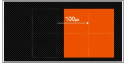
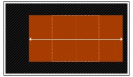
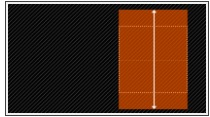
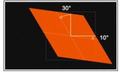
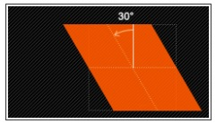
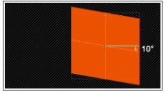
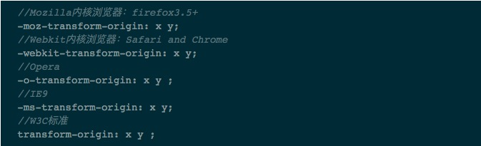

# transform

- transform 字面上就是变形，改变的意思。在css3中transform主要包括以下几种：旋转rotate,扭曲skew,缩放scale和移动translate以及矩阵变形matrix.  

##### 语法

```
  transform : none | <transform-function> [transform-function]*
  也就是：
  transform : rotate | scale | skew | translate | matrix;
```

none : 表示不进行变换；<transform-function> 表示一个或多个变换函数，以空格分开；换句话说就是我们同时对一个元素进行transform的多种属性操作，  
例如rotate,scale,translate三种，但这里需要提醒大家的，以往我们叠加效果都是用逗号（“，”）隔开，但transform中使用多个属性时需要有空格隔开  

transform属性实现了一些可用svg实现的同样的功能。它可以用于内联(inline)元素和块级(block)元素。它允许我们旋转，缩放和移动元素，他有几个属性值  
参数：rotate;translate;scale;skew;matrix;

#### 旋转rotate

rotate(<angle>): 通过指定的角度参数对原元素指定一个2D rotation(2D旋转),需先有transform-origin属性的定义  
transform-origin 定义的事旋转的基点，其中angle是指旋转角度，如果设置的值为正数表示顺时针旋转，如果设置的值为负数，则表示逆时针旋转  
如：transform:rotate(30deg)


#### 移动translate

移动translate我们分为三种情况：translate(x,y)水平方向和垂直方向同时移动(也就是X轴和Y轴同时移动)；translateX(x)仅水平方向移动(X轴移动);  
translateY(y)仅垂直方向移动(Y轴移动),具体方法是如下：  

1. translate(<translate-value>,[translate-value]):通过矢量[tx,ty]指定一个2D translation,tx是第一个过渡值参数，ty是第二个过渡值参数  
选项。如果未被提供，则ty以0作为其值。也就是translate(x,y),它表示对象进行平移，按照设定的x,y参数值，当值为负数时，反向移动物体，其基点默认为  
元素中心点，也可以根据transform-origin进行改变基点。如transform:translate(100px,20px):  


2. translateX(<translation-value>): 通过给定一个X方向上的数目指定一个translation.只向x轴进行移动元素，同样其基点是元素中心点，也可以根据  
transform-origin 改变基点位置。如:transform:translateX(100px):



3. translateY(<translation-value>) ：通过给定Y方向的数目指定一个translation。只向Y轴进行移动，基点在元素心点，可以通过transform-origin  
改变基点位置。如：transform:translateY(20px):  


##### 缩放scale

缩放scale和移动translate是极其相似，它也有三种情况:  

```
  scale(x,y) 使元素水平方向和垂直方向同时缩放
  scaleX(x)  使元素仅水平方向缩放
  scaleY(y)  使元素仅垂直方向缩放

  但它们具有相同的缩放中心点和基数，其中心点就是元素的中心点，缩放基数为1，如果其值大于1就放大，反之其值小于1，元素就缩小
```

1. scale(<number>[,<number>]):提供执行[sx,sy]缩放矢量的两个参数2D scale(2D缩放).如果第二个参数未提供，则取与第一个参数一样的值。  
scale(X,Y)是用于对元素进行缩放，可以通过transform-origin对元素的基点进行设置，同样基点在元素中心位置；其中X表示水平方向的缩放倍数，  
Y表示垂直方向的缩放倍数，而Y是一个可选参数，如果没有没有设置Y值，则表示X,Y两个方向的缩放倍数是一样的。并以X为准.  
如: transform:scale(2,1.5):  


2. scaleX(<number>) ： 使用 [sx,1] 缩放矢量执行缩放操作，sx为所需参数。scaleX表示元素只在X轴(水平方向)缩放元素,他的默认值是(1,1)   
，其基点一样是在元素的中心位置，我们同样是通过transform-origin来改变元素的基点。如：transform:scaleX(2):



3. scaleY(<number>) ： 使用 [1,sy] 缩放矢量执行缩放操作，sy为所需参数。scaleY表示元素只在Y轴（垂直方向）缩放元素，其基点同样是在元素   
中心位置，可以通过transform-origin来改变元素的基点。如transform:scaleY(2):



##### 扭曲skew

扭曲skew和translate,scale一样同样具有三种情况：  

```
 skew(x,y) 使元素在水平和垂直方向同时扭曲(X轴和y轴同时按一定的角度值进行扭曲变形);
 skewX(x)  使元素在水平方向扭曲变形(X轴扭曲变形)
 skewY(y)  使元素在水平方向扭曲变形(X轴扭曲变形)
```

使用方法:  

1. skew(<angle>[,<angle>]):X轴Y轴上的skew transformation(斜切变化).第一个参数对应X轴，第二个参数对应Y轴.如果第二个参数未提供，则值为0。  
也就是Y轴方向上无斜切。skew是用来对元素进行扭曲变形，第一个参数是水平方向扭曲角度，第二个参数是垂直方向扭曲角度。其中第二个参数是可选的，如果  
没有设置第二个参数，那么Y轴为0deg.同样是以元素中心点为基点，我们也可以通过transform-origin来改变元素的基点位置。  
如 transform:skew(30deg,10deg):  



2. skewX(<angle>):按给定角度沿 X轴指定一个skew transformation(斜切变换).skewX是使元素以其中心为基点，并在水平方向(X轴)进行扭曲变形  
同样通过transform-origin改变元素的基点.如transform:skewX(30deg):  



3. skewY(<angle>) ： 按给定的角度沿Y轴指定一个skew transformation（斜切变换）。skewY是用来设置元素以其中心为基点并按给定的角度在垂直方向  
（Y轴）扭曲变形。同样我们可以通过transform-origin来改变元素的基点。如：transform:skewY（10deg):  



##### 矩阵matrix

matrix(<number>, <number>, <number>, <number>, <number>, <number>):以一个含六值的(a,b,c,d,e,f)变换矩阵的形式指定一个2D变换，相当于  
直接应用一个[a b c d e f]变换矩阵。就是基于水平方向(X轴)和垂直方向(Y轴)重新定位元素，此属性值使用涉及到数学中的矩阵，这里简单说明:  

- 改变元素基点transform-origin

前面我们多次提到transform-origin这个东西，它的主要作用就是让我们在进行transform动作之前可以改变元素的基点位置，因为我们元素默认基点就是其  
中心位置。有时候我们需要在不同的位置对元素进行这些操作，那么我们就可以使用transform-origin来对元素进行基点位置改变，使元素位置不再基点位置.  
规则如下：  

transform-origin(X,Y)：用来设置元素的运动的基点（参照点）。默认点是元素中心。其中X和Y值可以是百分之,em,px,其中X也可以是字符参数值left,  
center,right; Y和X一样除了百分值外还可以设置字符值top,center,bottom,这个看上去有点像我们的background-position设置一样；  
下面列出它们相对应的写法:  

1. top left | left top 等价于 0 0 | 0% 0%
2. top | top center | center top 等价于 50% 0 
3. rigiht top | top right 等价于 100% 0
4. left | left center | center left 等价于 0 50% | 0% 50%
5. center | center center 等价于50% 50% (默认值)
6. right | right center | center right 等价于 100% 50%
7. bottom left | left bottom 等价于 0 100% | 0% 100%
8. bottom | bottom center | center bottom 等价于 50% 100%
9. bottom right | right bottom 等价于 100% 100%

其中left,center,right是水平方向取值，对应的百分值left=0%;center=50%;right=100%而top center bottom是垂直方向的取值,其中top=0%;  
center=50%;bottom=100%;如果只取一个值，表示垂直方向值不变，我们分别来看看以下几个实例  

(1) transform-origin:(left,top):


(2) transform-origin:(right):


(2) transform-origin:(25%,75%):


transform-origin并不是transform中的属性值，他具有自己的语法，下面列出各种浏览器内核下的语法规则：  


