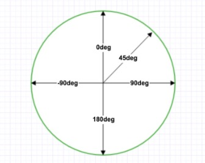

# 渐变

css3渐变(gradients) 可以让你两个或多个指定的颜色之间显示平稳的过渡。  

以前，你必须使用图像来实现这些效果。但是，通过使用 CSS3 渐变（gradients），你可以减少下载的事件和宽带的使用。  
此外，渐变效果的元素在放大时看起来效果更好，因为渐变（gradient）是由浏览器生成的。  

css3 定义了两种类型的渐变(gradients):  

- 线性渐变(Linear Gradients) - 向下／向上／向左／向右／对角方向   
- 径向渐变(Radual Gradients) - 由它们的中心定义  

## 线性渐变

- 从上到下  


```
  div {
    background : -webkit-linear-gradient(red,blue)    
    background : -o-linear-gradient(red,blue)    
    background : -moz-linear-gradient(red,blue)    
    background : linear-gradient(red,blue)    
  }
```

- 从左到右  

```
  div {
    background : -webkit-linear-gradient(left,red,blue)    
    background : -o-linear-gradient(left,red,blue)    
    background : -moz-linear-gradient(left,red,blue)    
    background : linear-gradient(left,red,blue)    
  }
```

- 对角  

```
  div {
    background : -webkit-linear-gradient(left top,red,blue)    
    background : -o-linear-gradient(bottom right,red,blue)    
    background : -moz-linear-gradient(bottom right,red,blue)    
    background : linear-gradient(to bottom right,red,blue)    
  }
```

### 使用角度
如果你想在渐变的方向上做更多的控制，你可以定义一个角度，  
而不用预定义方向(to bottom,to top、to right、to left、to bottom right，等等).  

  

但是，请注意很多浏览器(Chrome,Safari,fiefox等)的使用了旧的标准，即 0deg 将创建一个从左到右的渐变，  
90deg 将创建一个从下到上的渐变。换算公式 90 - x = y 其中 x 为标准角度，y为非标准角度。  

- 带有指定的角度的线性渐变：  

```
  div {
    background: -webkit-linear-gradient(180deg, red, blue); /* Safari 5.1 - 6.0 */
    background: -o-linear-gradient(180deg, red, blue); /* Opera 11.1 - 12.0 */
    background: -moz-linear-gradient(180deg, red, blue); /* Firefox 3.6 - 15 */
    background: linear-gradient(180deg, red, blue); /* 标准的语法(必须放在最后) */   
  }
```

### 使用多个颜色节点

-  带有多个颜色结点的从上到下的线性渐变：  

```
div{
  background: -webkit-linear-gradient(red, green, blue); /* Safari 5.1 - 6.0 */
  background: -o-linear-gradient(red, green, blue); /* Opera 11.1 - 12.0 */
  background: -moz-linear-gradient(red, green, blue); /* Firefox 3.6 - 15 */
  background: linear-gradient(red, green, blue); /* 标准的语法 */
}
```

- 下面的实例演示了如何创建一个带有彩虹颜色和文本的线性渐变：

```
div {
   /* Safari 5.1 - 6.0 */
  background: -webkit-linear-gradient(left,red,orange,yellow,green,blue,indigo,violet);
  /* Opera 11.1 - 12.0 */
  background: -o-linear-gradient(left,red,orange,yellow,green,blue,indigo,violet);
  /* Firefox 3.6 - 15 */
  background: -moz-linear-gradient(left,red,orange,yellow,green,blue,indigo,violet);
  /* 标准的语法 */
  background: linear-gradient(to right, red,orange,yellow,green,blue,indigo,violet); 
}
```


### 使用透明度(transparent)

css3渐变也支持透明度(transparent),可用于创建减弱变淡的效果。  
为了添加透明度，我们使用rgba()函数来定义颜色结点。rgba()函数中的最后一个参数可以是从0-1的值, 它定义了颜色的透明度：  
0表示完全透明，1表示完全不透明。   

  ps :  RGBA是代表Red(红色) Green(绿色)  Blue(蓝色) 和 Alpha的色彩空间，也就是透明度／不透明度。虽然它有的时候  
        被描述为一个颜色空间，但是它其实仅仅是RGB模型的附加了额外的信息。  

下面的实例演示了从左边开始的线性渐变。起点是完全透明，慢慢过渡到完全不透明的红色：  

```
  div {
    background: -webkit-linear-gradient(left,rgba(255,0,0,0),rgba(255,0,0,1)); /* Safari 5.1 - 6 */
    background: -o-linear-gradient(right,rgba(255,0,0,0),rgba(255,0,0,1)); /* Opera 11.1 - 12*/
    background: -moz-linear-gradient(right,rgba(255,0,0,0),rgba(255,0,0,1)); /* Firefox 3.6 - 15*/
    background: linear-gradient(to right, rgba(255,0,0,0), rgba(255,0,0,1)); /* 标准的语法 */
  }
```

### 重复的线性渐变

repeating-linear-gradient()函数用于重复线性渐变：  

```
  div{
    /* Safari 5.1 - 6.0 */
    background: -webkit-repeating-linear-gradient(red, yellow 10%, green 20%);
    /* Opera 11.1 - 12.0 */
    background: -o-repeating-linear-gradient(red, yellow 10%, green 20%);
    /* Firefox 3.6 - 15 */
    background: -moz-repeating-linear-gradient(red, yellow 10%, green 20%);
    /* 标准的语法 */
    background: repeating-linear-gradient(red, yellow 10%, green 20%);
  }
```


## CSS3径向渐变

径向渐变由它的中心定义。  
为了创建一个径向渐变，你也必须至少定义两种颜色结点。颜色结点即你想要呈现平稳过渡的颜色。同时，你也可以指定渐变的中心，  
形状（圆形或椭圆形），大小。默认情况下，渐变的中心是center(表示在中心点)，渐变的形状是ellipse(表示椭圆形)，  
渐变的大小是farthest-corner(表示到最远的角落)。  

- 径向渐变 - 颜色结点均匀分布（默认情况下）

```
div {
  background: -webkit-radial-gradient(red, green, blue); /* Safari 5.1 - 6.0 */
  background: -o-radial-gradient(red, green, blue); /* Opera 11.6 - 12.0 */
  background: -moz-radial-gradient(red, green, blue); /* Firefox 3.6 - 15 */
  background: radial-gradient(red, green, blue); /* 标准的语法 */
}
```

- 径向渐变 - 颜色结点不均匀分布  

```
  background: -webkit-radial-gradient(red 5%, green 15%, blue 60%); /* Safari 5.1 - 6.0 */
  background: -o-radial-gradient(red 5%, green 15%, blue 60%); /* Opera 11.6 - 12.0 */
  background: -moz-radial-gradient(red 5%, green 15%, blue 60%); /* Firefox 3.6 - 15 */
  background: radial-gradient(red 5%, green 15%, blue 60%); /* 标准的语法 */
```


### 设置形状
shape 参数定义了形状。它可以是值circle 或 ellipse。其中，circle表示圆形，ellipse表示椭圆形。默认值是ellipse.  

- 形状为圆形的径向渐变：  
``` 
  background: -webkit-radial-gradient(circle, red, yellow, green); /* Safari 5.1 - 6.0 */
  background: -o-radial-gradient(circle, red, yellow, green); /* Opera 11.6 - 12.0 */
  background: -moz-radial-gradient(circle, red, yellow, green); /* Firefox 3.6 - 15 */
  background: radial-gradient(circle, red, yellow, green); /* 标准的语法 */
```


### 不同尺寸大小关键字的使用

size 参数定义了渐变的大小。它可以是以下四个值。  

> closest-side  
> farthest-side  
> closest-corner  
> farthest-corner  


```
div {
    background: -webkit-radial-gradient(60% 55%, closest-side,blue,green,yellow,black); /* Safari 5.1 - 6.0 */
    background: -o-radial-gradient(60% 55%, closest-side,blue,green,yellow,black); /* Opera 11.6 - 12.0 */
    background: -moz-radial-gradient(60% 55%, closest-side,blue,green,yellow,black); /* Firefox 3.6 - 15 */
    background: radial-gradient(60% 55%, closest-side,blue,green,yellow,black); /* 标准的语法（必须放在最后） */
}

div {
    background: -webkit-radial-gradient(60% 55%, farthest-side,blue,green,yellow,black); /* Safari 5.1 - 6.0 */
    background: -o-radial-gradient(60% 55%, farthest-side,blue,green,yellow,black); /* Opera 11.6 - 12.0 */
    background: -moz-radial-gradient(60% 55%, farthest-side,blue,green,yellow,black); /* Firefox 3.6 - 15 */
    background: radial-gradient(60% 55%, farthest-side,blue,green,yellow,black); /* 标准的语法（必须放在最后） */
}

div {
    background: -webkit-radial-gradient(60% 55%, closest-corner,blue,green,yellow,black); /* Safari 5.1 - 6.0 */
    background: -o-radial-gradient(60% 55%, closest-corner,blue,green,yellow,black); /* Opera 11.6 - 12.0 */
    background: -moz-radial-gradient(60% 55%, closest-corner,blue,green,yellow,black); /* Firefox 3.6 - 15 */
    background: radial-gradient(60% 55%, closest-corner,blue,green,yellow,black); /* 标准的语法（必须放在最后） */
}

div {
    background: -webkit-radial-gradient(60% 55%, farthest-corner,blue,green,yellow,black); /* Safari 5.1 - 6.0 */
    background: -o-radial-gradient(60% 55%, farthest-corner,blue,green,yellow,black); /* Opera 11.6 - 12.0 */
    background: -moz-radial-gradient(60% 55%, farthest-corner,blue,green,yellow,black); /* Firefox 3.6 - 15 */
    background: radial-gradient(60% 55%, farthest-corner,blue,green,yellow,black); /* 标准的语法（必须放在最后） */
}
```

### 重复的径向渐变

repeating-radial-gradient()函数. 

```
div{
   /* Safari 5.1 - 6.0 */
  background: -webkit-repeating-radial-gradient(red, yellow 10%, green 15%);
  /* Opera 11.6 - 12.0 */
  background: -o-repeating-radial-gradient(red, yellow 10%, green 15%);
  /* Firefox 3.6 - 15 */
  background: -moz-repeating-radial-gradient(red, yellow 10%, green 15%);
  /* 标准的语法 */
  background: repeating-radial-gradient(red, yellow 10%, green 15%);
}
 
```
