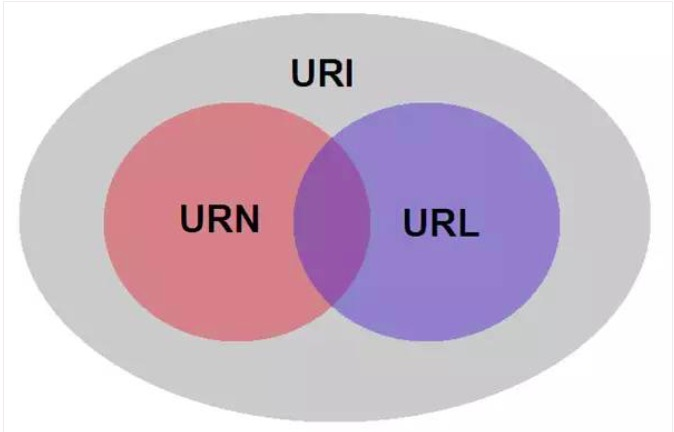

# 三者之间的关系

现在我们简单的把URN和URL都看作是URI，但严格来说URI可以进一步划分为URL、URN或者两者的组合，所以了解这三折之间的区别将会很有趣。  

## 引文

统一资源标识符(URI) 提供了一个简单，可扩展的资源标识方式。URI规范中的语义和语法来源于万维网全球信息主动引入的概念.

## 区别

举个例子，我们可以很好地理解URN和URL之间的区别。  
如果是一个人，我们会想到他的姓名和住址。  

URL类似于住址，它告诉你一种寻找目标的方式(在这个例子中，是通过街道地址找到一个人)。要知道，上述定义同时也是一个URI.  

相对的，我们可以把一个人的名字看作是URN;因此可以用URN来唯一表示一个实体。由于可能存在同名（姓氏也相同）的情况，所以更准确地说，  
人名这个例子并不是十分恰当。更为恰当的是书籍的ISBN( International Standard Book Number   
是专门为识别图书等文献而设计的国际编号) 码和产品在系统内的序列号，尽管没有告诉你用什么方式活着到什么地方去找到目标，但是  
你有足够的信息来检索到它.  

所有的URN都遵循如下语法(引号内的短语是必须的)：  
 
> <URN> ::= "urn:"<NID>":"<NSS>  

其中NID是命名空间标识符，NSS是标识命名空间的特定字符串。   

## 一个用于理解这三者的例子

我们来看一下上述概念如何应用于我们息息相关的互联网。  

Wikipedia 解释：  

- 关于URL :   
 URL 是URI的一种，不仅标识了Web资源，还指定了操作活着获取方式，同时指出了主要访问机制和网络位置。  

- 关于URN :   
 URN 是URI的一种，用特定命名空间的名字标识资源。使用URN可以在不知道其网络位置及访问方式的情况下讨论资源  

我们一起来看下面这个虚构的例子。这是一个URI:  

`http://bitpoetry.io/posts/hello.html#intro`  

我们开始分析  

`http://`  

是定义如何访问资源的方式。另外  

`bitpoetry.io/posts/hello.html`  

是资源存放的位置，那么，在这个例子中，  

`#intro`  

是资源.  

URL是URI的一个子集，告诉我们访问网络位置的方式。在我们的例子中，URL应该如下所示：  

`http://bitpoetry.io/posts/hello.html`  

URN 是URI的子集，包括名字（给定的命名空间内），但是不包括访问方式，如下所示：  

`bitpoetry.io/posts/hello.html#intro`  

以上就是区别.  

- URI可以被分为URL、URN或两者的组合。如果你一直使用URI这个术语，就不会有错。  
