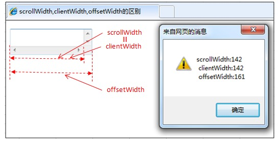
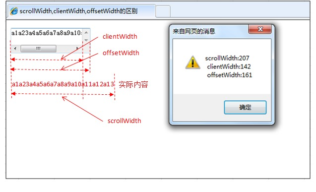

# 目录  
- [CRLF](#CRLF)
- [thead,tbody,tfoot](#thead,tbody,tfoot)
- [colgroup标签](#colgroup标签)
- [label标签](#label标签)
- [kbd标签](#kbd标签)
- [querySelector方法](#querySelector方法)
- [transitionend事件](#transitionend事件)
- [video标签](#video标签)
- [scrollWidth,clientWidth,offsetWidth区别](#scrollWidth,clientWidth,offsetWidth区别)
- [元素节点，属性节点，文本节点](#元素节点，属性节点，文本节点)
- [contenteditable](#contenteditable)
- [事件句柄](#事件句柄)


## CRLF

```
  CRLF -- Carriage-Return Line-Feed 回车换行
```

## thead,tbody,tfoot

```
  <table border="1">
    <thead>
      <tr>
        <th>Month</th>
        <th>Savings</th>
      </tr>
    </thead>
    <tfoot>
      <tr>
        <td>Sum</td>
        <td>$180</td>
      </tr>
    </tfoot>

    <tbody>
      <tr>
        <td>January</td>
        <td>$100</td>
      </tr>
      <tr>
        <td>February</td>
        <td>$80</td>
      </tr>
    </tbody>
  </table>
```

- 字面理解分别是  表格的头，身体和脚。  
tbody 这个标签可以控制表格分行下载，可以让其中的内容比网页中别的东西(如图片)先下载下来  
这样可以让别人先看到网页的实质性的内容，不用等那么久了，在需要分行下载处加上<tbody>和</tbody>  

## colgroup

<colgroup>标签 用于对表格中的列进行组合，以便对其进行格式化。  
如需对全部列应用样式，<colgroup> 标签很有用，这样就不需要对各个单元和各行重复应用样式了。  
<colgroup> 标签只能在 table 元素中使用。  

```
<table width="100%" border="1">
  <colgroup span="2" align="left"></colgroup>
  <colgroup align="right" style="color:#0000FF;"></colgroup>
  <tr>
    <th>ISBN</th>
    <th>Title</th>
    <th>Price</th>
  </tr>
  <tr>
    <td>3476896</td>
    <td>My first HTML</td>
    <td>$53</td>
  </tr>
</table>
```


## label标签

在用户注册的时候，常常用户点击文字就需要将光标聚焦到对应的表单上面，依靠<label>标签的for属性可以实现  

```
...

  <table>
      <tr>
        <td><label for="username">用户名：</label></td>
        <td><input type='text' name='username' id='username' /></td>
      </tr>
      <tr>
        <td><label for="password">用户名：</label></td>
        <td><input type='password' name='password' id='password' /></td>
      </tr>
  </label>

...

```

## kbd标签

```
  <kbd> 标签定义键盘文本

  说到技术概念上的特殊样式时，既要提要<kbd>标签。正如你已经猜到的，它用来表示文本是从键盘上键入的。

  浏览器通常用等宽字体来显示改标签中包含的文本


  栗子:

  键入<kbd>quit</kbd> 来退出程序,或者键入<kbd>menu</kbd> 来返回主菜单。
```


## HTML DOM querySelector方法

```
  获取文档中id = "demo" 的元素
  document.querySelector("#demo")

  querySelector()方法返回文档中匹配指定css选择器的一个元素.

  ps : querySelector()方法仅仅返回匹配指定选择器的第一个元素。如果你需要返回所有元素，请使用querySelectorAll()方法替代

  获取文档中第一个<p>元素:
  document.querySelector("p");

```


## transitionend事件

```
  该事件在css 完成过渡后触发 
  ps : 如果过渡在完成前移除，例如 css transition-property 属性被移除，过渡事件将不被触发。


```

举个栗子：

```
<!DOCTYPE html>
<html>
<head>
<meta charset="utf-8">
<title>菜鸟教程(runoob.com)</title>
<style> 
#myDIV {
    width: 100px;
    height: 100px;
    background: red;
    -webkit-transition: width 2s; /* For Safari 3.1 to 6.0 */
    transition: width 2s;
}
#myDIV:hover {
    width: 400px;
}
</style>
</head>
<body>

<p>鼠标移动到 div 元素上，查看过渡效果。</p>
<div id="myDIV"></div>
<p><b>注意：</b>该实例无法在 Internet Explorer 9 及更早 IE 版本上工作。</p>
<script>
//  Safari 3.1 到 6.0 版本代码
document.getElementById("myDIV").addEventListener("webkitTransitionEnd", myFunction);
// 标准语法
document.getElementById("myDIV").addEventListener("transitionend", myFunction);
function myFunction() {
    this.innerHTML = "过渡事件触发 - 过渡已完成";
    this.style.backgroundColor = "pink";
}
</script>

</body>
</html>
```


## video标签

视频标签

您可以通过使用document.createElement()方法来创建<video>元素:

```
  var x = document.createElement('VIDEO')
```

Video 对象属性

```
    
  audioTracks                  返回表示可用音频轨道的AudioTrackList对象
  audioplay                    设置或返回是否在就绪（加载完成）后即播放视频
  buffered                     返回表示视频已缓冲部分的TimeRanges对象
  controller                   返回表示视频当前媒体控制器的MediaController对象
  controls                     设置或返回视频是否应该显示控件(比如播放/暂停等)
  crossOrigin                  设置或返回视频的CORS设置
  currentTime                  设置或返回视频中的当前播放位置(以秒算)
  defaultMuted                 设置或返回视频默认是否静音
  defaultPlaybackRate          设置或返回视频的默认播放速度
  duration                     返回视频的长度(以秒算)
  ended                        返回视频的播放是否已结束
  error                        返回表示视频错误状态的MediaError对象
  height                       设置或返回视频的height属性的值
  loop                         设置或返回视频是否应在结束时再次播放
  mediaGroup                   设置或返回视频所属媒介组合的名称
  muted                        设置或返回是否关闭声音
  networkState                 返回视频的当前网络状态
  paused                       设置或返回视频是否暂停
  playbackRate                 设置或返回视频拍播放的速度
  played                       返回表示视频已播放部分的TimeRanges对象
  poster                       设置或返回视频的poster属性的值
  preload                      设置或返回视频的preload属性的值
  readyState                   返回视频当前的就绪状态
  seekable                     返回表示视频可寻址部分的TimeRanges对象
  seeking                      返回用户当前是否正在视频中进行查找
  src                          设置或返回视频的src属性的值
  startDate                    返回表示当前时间偏移的Date对象
  textTracks                   返回表示可用文本轨道的TextTrackList对象
  videoTracks                  返回表示可用视频轨道的VideoTrackList对象
  volume                       设置或返回视频的音量
  width                        设置或返回视频的width属性的值

```


video对象方法

```

  addTextTrack()               向视频添加新的文本轨道
  canPlayType()                检查浏览器是否能够播放指定的视频类型
  load()                       重新加载视频元素
  play()                       开始播放视频
  pause()                      暂停当前播放的视频
```

## scrollWidth,clientWidth,offsetWidth区别
- scrollWidth: 对象的实际内容，不包边线宽度，会随对象中内容超过可视区后而变大。  
- clientWidth: 对象内容的可视区的宽度，不包滚动条等边线，会随对象显示大小的变化而变化。  
- offsetWidth: 对象整体的实际宽度，包括滚动条等边线，会随对象显示大小的变化而变化。  


```
情况1:  
元素内无内容或者内容不超过可视区，滚动不出现或不可用的情况。  
srcollWidth = clientWidth,两者皆为内容可视区的宽度。  
offsetWidth为元素的实际宽度。   
```

  


```
情况2:  
元素的内容超过可视区，滚动条出现和可用的情况下。  
scrollWidth>clientWidth.  
scrollWidth为实际内容的宽度。  
clientWidth时内容可视区的宽度。  
offsetWidth时元素的实际宽度.  

```

  


## 元素节点，属性节点，文本节点

#### 元素节点

```
import React from 'react'

export default class Node extends React.Component{

  onClick = () =>{
    var d = document.getElementById("john");
    console.log(d.nodeType)  
    console.log(d.nodeName)
    console.log(d.nodeValue)
  }

  render(){
    return (
      <div>
        <p id="join" name="myname">John</p>
        <p>Doe</p>
        <p id='jack'>Jack</p>

        <button onClick={()=>this.onClick}>
      </div>
    )
  }
}
```

- 运行结果，三个属性值分别是:  

>>nodeType:ELEMENT_NODE  
>>nodeType值:1  
>>nodeName:元素标记名 //此处为p  
>>nodeValue:null  


#### 属性节点

```
import React from 'react'

export default class Node extends React.Component{

  onClick = () =>{
    var d = document.getElementById("john").getAttributeNode("name");
    console.log(d.nodeType)  
    console.log(d.nodeName)
    console.log(d.nodeValue)
  }

  render(){
    return (
      <div>
        <p id="join" name="myname">John</p>
        <p>Doe</p>
        <p id='jack'>Jack</p>

        <button onClick={()=>this.onClick}>
      </div>
    )
  }
}
```

- 运行结果，三个属性值分别是:  

>>nodeType:ATTRIBUTE_NODE  
>>nodeType值:2  
>>nodeName:属性名 //name  
>>nodeValue:属性值 //myname  

#### 文本节点

```
import React from 'react'

export default class Node extends React.Component{

  onClick = () =>{
    var d = document.getElementByTagName("p")[0].firstChild;
    console.log(d.nodeType)  
    console.log(d.nodeName)
    console.log(d.nodeValue)
  }

  render(){
    return (
      <div>
        <p id="join" name="myname">John</p>
        <p>Doe</p>
        <p id='jack'>Jack</p>

        <button onClick={()=>this.onClick}>
      </div>
    )
  }
}
```

- 运行结果，三个属性值分别是:  

>>nodeType:TEXT_NODE  
>>nodeType值:3  
>>nodeName: #text  
>>nodeValue:文本内容 //John  


## contenteditable

改属性规定是否可编辑元素的内容  

```
  true : 可编辑
  false: 不可编辑

  <p contenteditable="true">这是一段可编辑的段落。请试着编辑该文本。</p>
```


## 事件句柄

```
事件句柄 是指 事件发生时要进行的操作

(又称事件处理函数),每一个事件均对应一个事件句柄，在程序执行时，将相应的函数或语句指定给事件句柄
```


### 导航栏传中文参数

```
传之前: escape("我是要传的中文");
传之后: unescape("我是要传的中文");

```
