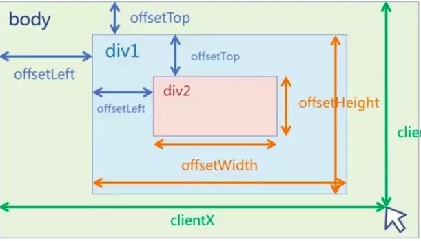

# javascript 操作DOM那些坑

- DOM 的工作模式是: 先加载文档的静态内容，再以动态方式对它们进行刷新，动态刷新不影响文档的静态内容  
- PS:IE中所有DOM对象都是以COM对象的形式实现的，这意味着IE中的DOM可能会和其他浏览器有一定的差异  

##node接口

```
  特性/方法                类型/返回类型                  说明

  nodeName                String                   节点的名字；根据节点的类型而定义
  nodeValue               String                   节点的值；根据节点的类型而定义
  nodeType                Number                   节点的类型常量值之一
  ownerDocument           Document                 返回某元素的根元素
  firstChild              Node                     指向在childNodes列表中的第一个节点
  lastChild               Node                     指向在childNodes列表中的最后一个节点
  childNodes              NodeList                 所有子节点的列表
  previousSibling         Node                     返回选定节点的上一个同级节点，若不存在，则返回NULL 
  nextSibling             Node                     返回选定节点的下一个同级节点，若不存在，则返回NULL
  hasChildNodes()         Boolean                  如果当前元素节点拥有子节点，返回true,否则返回false
  atrributes              NamedNodeMap             返回包含被选节点属性的 NamedNodeMap
  appendChild(node)       node                     将node添加到childNodes的末尾
  removeChild(node)       node                     从childNodes中删除node
  replaceVChild           node                     将childNodes中oldnode替换成newnode
  (newnode,oldnode)
  insertBefore            node                     在已有子节点之前插入新的子节点
```

- firstChild相当于 childNodes[0];lastChild 相当于 childNodes[box.childNodes.length - 1]

#### nodeType返回节点的类型

>> 元素节点返回1
>> 属性节点返回2
>> 文本节点返回3


### innerHTML 和 nodeValue

>> 对于文本节点,nodeValue属性包含文本
>> 对于属性节点,nodeValue属性包含属性值
>> nodeValue属性对于文档节点和元素节点是不可用的

- 两者区别

```
  box.childNodes[0].nodeValue = '<strong>abc</strong>' //<strong>abc<stong>
  abcbox.innerHTML = '<strong>abc</strong>' //abc
```

### nodeName属性获得节点名称

>> 对于元素节点返回的是标记名称,如 <a href><a>返回的是"a"
>> 对于属性节点返回的属性名称,如 class="test" 返回的是test
>> 对于文本节点返回的是文本的内容

### tagName

```
document.getElementByTagName(tagName):返回一个数组，包含对这些节点的引用
```

- getElementsByTagName()方法将返回一个对象数组HTMLCollection(NodeList),这个数组保存着所有相同元素名的节点列表  

```
document.getElementByTagName("*")
```

- PS:IE浏览器在使用通配符的时候,会把文档最开始的html的规范声明当作第一个元素节点

>> document.getElementsByTagName('li');//获取所有 li 元素，返回数组
>> document.getElementsByTagName('li')[0];//获取第一个 li 元素，HTMLLIElement
>> document.getElementsByTagName('li').item(0);//获取第一个 li 元素，HTMLLIElement
>> document.getElementsByTagName('li').length;//获取所有 li 元素的数目

- 节点的绝对引用  

>> 返回文档的根节点：document.documentElment
>> 返回当前文档中被激活的标签节点：document.activeElement
>> 返回鼠标移出的源节点：event.fromElement
>> 返回鼠标移入的源节点：event.toElement
>> 返回激活事件的源节点：event.srcElement

- 节点的相对引用:(设当前对节点为node)

>> 返回父节点:node.parentNode || node.parentElement(IE)
>> 返回子节点集合(包含文本节点及标签节点): node.childNodes
>> 返回子标签节点集合:node.children
>> 返回子文本节点集合:node.textNodes
>> 返回第一个子节点:node.firstChild
>> 返回最后一个子节点:node.lastChild
>> 返回同属下一个节点:node.nextSibing
>> 返回同属上一个节点:node.previousSibing

- 节点信息

>> 是否包含某节点:node.contains()
>> 是否有子节点: node.hasChildNodes()

- 创建新节点

>> createDocumentFragment() -- 创建文档碎片节点
>> createElement(tagname) --创建标签名文tagname的元素
>> createTextNode(text) -- 创建包含文本text的文本节点


### 获取鼠标点击事件的位置

```
  document.onclick = mouseChilk;

  function mouseChilk(ev){
    ev = ev || window.event; //window.event用来兼容IE
    var x = 0;var y = 0;

    if(ev.pageX){
      x = ev.pageX;
      y = ev.pageY;
    }else if(ev.clientX){
      var offsetX = 0 , offsetY = 0;
      if(document.documentElement.scrollLeft){
        offsetX = document.documentElement.scrollLeft;
        offsetY = document.documentElement.scrollTop;
      }else if(document.body){
        offsetX = document.body.scrollLeft;
        offsetY = document.body.scrollTop;
      }
      x = ev.clientX + offsetX;
      y = ev.clientY + offsetY;
    }
    console.log('您点击的位置是 x='+x+"y="+y)
  }
```

- 问题一：Firefox，Chrome、Safari和IE9都是通过非标准事件的pageX和pageY属性来获取web页面的鼠标位置的。pageX/Y获取到的是触发点相对文档区域左上角距离，以页面为参考点，不随滑动条移动而变化

- 问题二：在IE 中，event 对象有 x, y 属性（事件发生的位置的 x 坐标和 y 坐标）火狐中没有。在火狐中，与event.x 等效的是event.pageX。event.clientX 与 event.pageX 有微妙的差别（当整个页面有滚动条的时候），不过大多数时候是等效的。
offsetX:IE特有，chrome也支持。鼠标相比较于触发事件的元素的位置,以元素盒子模型的内容区域的左上角为参考点,如果有boder,可能出现负值

- 问题三：
scrollTop为滚动条向下移动的距离，所有浏览器都支持document.documentElement。

### 参照表
（+为支持，-为不支持）

>>offsetX/offsetY：W3C- IE+ Firefox- Opera+ Safari+ chrome+
>>x/y：W3C- IE+ Firefox- Opera+ Safari+ chrome+
>>layerX/layerY：W3C- IE- Firefox+ Opera- Safari+ chrome+
>>pageX/pageY：W3C- IE- Firefox+ Opera+ Safari+ chrome+
>>clientX/clientY：W3C+ IE+ Firefox+ Opera+ Safari+ chrome+
>>screenX/screenY：W3C+ IE+ Firefox+ Opera+ Safari+ chrome

- 查看下方DEMO：
你会发现offsetX在Firefox下是undefined，在chrome和IE则会正常显示。

- [产看demo](https://jsfiddle.net/f4am208m/embedded/result/)



- offsetLeft 和 style.left  

>> style.left返回的是字符串，比如 10px.而offsetLeft返回的是数值,比如数值10
>> style.left是可读写的，offsetLeft是指读写的
>> style.left的值需要事先定义(在样式表中定义无效,只能取到在html中定义的值),否则取到的是值是空的


#### getComputedStyle于currentStyle

- getComputedStyle()接收两个参数：要取得计算样式的元素和一个伪元素，如果不需要伪元素，则可以是null.  
  然而，在IE中，并不支持getComputedStyle,IE提供了currentStyle属性  

- getComputedStyle(obj,false) 是支持w3c(FF12,chrome14,safari):在FF新版本中只需要第一个参数，即  
  操作对象,第二个参数写"false"也是大家通用的写法,目的是为了兼容老版本的火狐浏览器  
缺点：在标准浏览器中正常,但在IE6/7/8中不支持

```
  window.onload = function(){
    var oBtn = document.getElementById('btn');
    var oDiv = document.getElementById('div1');

    oBtn.onclick = function(){
      //console.log(oDiv.style.windth); 写在样式表里无法读取,只能得到写在行内的
      //console.log(getComputedStyle(oDiv).width); //适用于标准浏览器       IE6、7、8不识别
      //console.log(oDiv.currentStyle.width); //适用于IE浏览器，标准浏览器不识别

      if(oDiv.currentStyle){
        console.log(oDiv.currentStyle.width)
      }else{
        console.log(getComputedStyle(oDiv).width);
      }
    }
  }
```


### 取消表单提交

```
<script type="text/javascript">
  function listenEvent(eventObj,event,eventHandler){
    if(eventObj.addEventListener){
      eventObj.addEventListener(event,eventHandler,false);
    }else if(eventObj.attachEvent){
      event = "on" + event;
      eventObj.attachEvent(event,eventHandler);
    }else{
      eventObj["on" + event] = eventHandler;
    }
  }

  function cancelEvent(event){
    if(event.prevenDefault){
      event.preventDefault();// w3c
    }else{
      event.returnValue = true;//IE
    }
  }

  window.onload = function(){
    var form = ducument.forms['picker'];
    listenEvent(form,"submit",validateFields);
  };

  function validateFields(evt){
    evt = evt ? evt : window.event;
    
    ...

    if(invalid){
      vancelEvent(evt);
    }
  }


</script>
```

### 确定浏览器窗口的尺寸

- 对于主流浏览器来说 ，比如IE9、Firefox，Chrome和Safari，支持名为innerWidth和innerHeight的窗口对象属性,  
  它返回窗口的视口区域，减去任何滚动条的大小。IE不支持innerWidth和innerHeight  

```
<script type="text/javascript">
  function size(){
    var w = 0,h=0;
    if(!window.innerWidth){
      w = (document.documentElement.clientWidth ? document.documentElement.clientWidth : document.body.clientWidth;)

      h = (document.documentElement.clientHeight ? document.documentElement.clientHeight : document.body.client.Height) 
    }else{
      w = window.innerWidth;
      h = window.innerHeight;
    }
    return {width:w,height:h};
  }

  console.log(size()) //


</script>
```

- 实用的javaScript方案(涵盖所有浏览器):  

```
var w =window.innerWidth ||  document.documentElement.clientWidth || document.body.clientWidth;
var h=window.innerHeight || document.documentElement.clientHeight|| document.body.clientHeight;
```

- 对于 IE 6、7、8的方案如下：
```
document.documentElement.clientHeight
document.documentElement.clientWidth
```

- 或者

```
document.body.clientHeight
document.body.clientWidth
```

- Document对象的body属性对应HTML文档的<body>标签。Document对象的documentElement属性则表示HTML文档的根节点  

#### attributes属性

- attributes属性返回该节点的属性节点集合  

```
  document.getElementById('box').attributes //NamedNodeMap
  document.getElementById('box').attributes.length;//返回属性节点个数
  document.getElementById('box').attributes[0];//Attr,返回最后一个属性节点
  document.getElementById('box').attributes[0].noteTypes;//2,节点属性
  document.getElementById('box').attributes[0].noteValue;//属性值
  document.getElementById('box').attributes['id'];//Attr,返回属性为id的节点
  document.getElementById('box').attributes.getNamedItem('id');Attr
```


#### setAttribute 和 getAttribute

- IE中是不认识 class属性的,需要改为className属性,同样,在Firefox中,也不认识className属性的Firefox只认识class属性,  
  所以通常的做法如下:  

```
element.setAttribute(class,value); //for Firefox
element.setAttribute(className,value); //for IE
```

- IE：可以使用获取常规属性的方法来获取自定义属性，也可以使用getAttribute()获取自定义属性  
- Firefox：只能使用getAttribute()获取自定义属性  

- 解决方法：统一通过getAttribute()获取自定义属性  

```
  document.getElementById('box').getAttribute('id');//获取元素的id值
  document.getElementById('box').id;//获取元素的id值
  document.getElementById('box').getAttribute('mydiv');获取元素的自定义属性值
  document.getElementById('box').mydiv;// 获取元素的自定义属性值,IE不支持
  document.getElementById('box').getAttribute('class');//获取元素的 class 值，IE 不支持
  document.getElementById('box').getAttribute('className');//firefox 不支持
```


- removeAttribute()方法

```
 removeAttribute()可以移除HTML属性
 document.getElementById('box').removeAttribute('style')移除属性
```

PS：IE6 及更低版本不支持 removeAttribute()方法。

### 跨浏览器事件Event对象

```
  <!doctype html>
<html lang="en">
<head>
    <meta charset="UTF-8">
    <title>Document</title>
    <style type="text/css">
       #drop{
           width: 300px;
           height: 200px;
           background-color: #ff0000;
           padding: 5px;
           border: 2px solid #000000;
       }
       #item{
           width: 100px;
           height: 100px;
           background-color: #ffff00;
           padding: 5px;
           margin: 20px;
           border: 1px dashed black;
       }
       *[draggable = true]{
           -moz-user-select: none;
           -webkit-user-select: none;
           cursor: move;
       }
    </style>
</head>
<body>
<div>
    <p>将金黄色的小方块拖到红色的大方块中，不兼容IE7及以下浏览器，兼容主流浏览器！</p>
</div>
<div id="item" draggable="true"></div>
<div id="drop"></div>

<script type="text/javascript">
  function listenEvent(target,type,handler){
    if(target.addEventListener){//w3c
      target.addEventListener(type,handler,false)
    }else if(target.attachEvent){//IE
      type = "on" +type;
      target.attachEvent(type,handler,false);//IE
    }else{
      target["on" + type] = handler;
    }
  }

  // 取消事件
  function cancelEvent(e){
    if(e.preventDefault){
      e.preventDefault();//w3c
    }else {
      e.returnValue = false; //IE
    }
  }

  // 取消传递
  function cancelPropagation(e){
    e.cancelPropagation();//23c
  }


</script>
</body>
</html>
```
