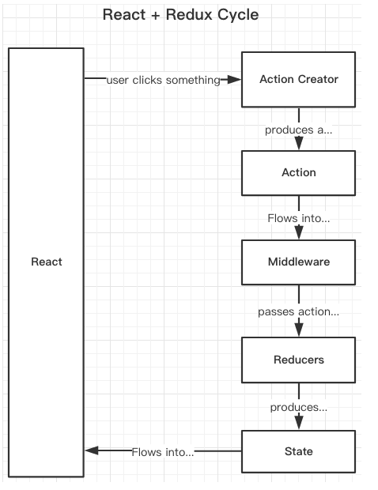

# redux异步流之 redux-saga  

  

## 1. 介绍  

> It is Redux middleware for handling side effects.  

这里包含了两个信息：  

首先，redux-saga是一个redux的中间件，而中间件的作用是为了redux提供额外的功能。  

其次，我们都知道，在reducers中的所有操作都是同步的并且是纯粹的，即reducers都是纯函数，  
`纯函数是指一个函数的返回结果只依赖于它的参数，并且在执行过程中不会对外部产生副作用`，  
即给它传什么，就吐出什么。但是在实际的应用开发中，我们希望做一些异步的（如Ajax请求）且   
不纯粹的操作（如改变外部的状态），这些在函数式编程范式中被称为“副作用”。   

Redux的作者将这些副作用的处理通过提供中间件的方式让开发者自行选择进行实现。  

> Redux-saga 就是用来处理上述副作用（异步任务）的一个中间件。他是一个接受事件，  
> 并可能触发新事件的过程管理者，为你的应用管理复杂的流程。  

## 先说一说 redux-thunk  

redux-thunk和 redux-saga是redux应用中最常用的两种异步流处理方式。  

