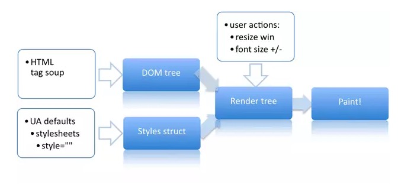
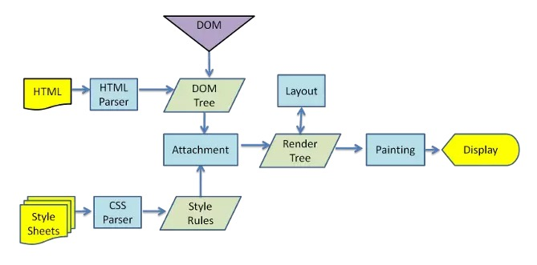
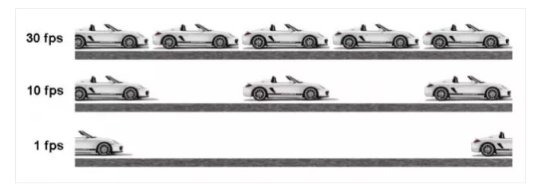
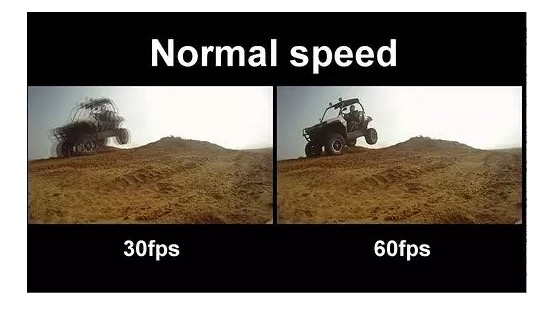
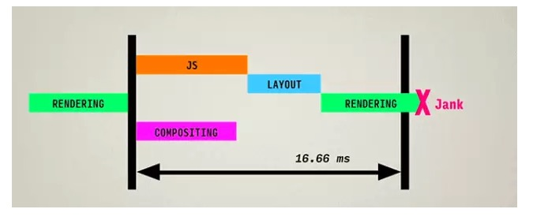

# 网页性能管理详解

性能很差的网页响应非常缓慢，占用大量的CPU和内存,浏览起来很卡，效果也差.  

### 网页生成过程

  
 
网页生成过程，大致可分成五步.  

```
1. HTML代码转化成DOM

2. CSS代码转化成CSSDOM(CSS Object Model)

3. 结合DOM和CSSOM,生产一棵渲染树(包含每个节点的视觉信息)

4. 生成布局(layout),即将所有渲染树的所有节点进行平面合成

5. 将布局绘制(paint) 在屏幕上
```

这五步里，第一步到第三步非常快，耗时的是第四步和第五步。  

"生产布局"(flow)和“绘制”(paint)这两步，合称为“渲染”(render)  

  


### 重排和重绘

网页生成的时候，至少会渲染一次。用户访问的过程中，还会不断重新渲染。  

以下三种情况，会导致网页重新渲染。  

```
1. 修改DOM

2. 修改样式表

3. 用户事件(比如鼠标悬停，页面滚动，输入框键入文字，改变窗口大小等等)
```

重新渲染，就需要重新生成布局，前者叫做“重排”(reflow),后者叫做"重绘"(repaint).  

需要注意的是，“重绘”不一定需要“重排”，比如改变某个网页元素的颜色，就只会触发“重绘”，不会触发“重排”,因为布局没有改变。  
但是，“重排”必然导致“重绘”，比如改变一个网页元素的位置，就会同时触发“重排”和“重绘”，因为布局改变了。  

### 对于性能的影响

**重排和重绘 会不断触发，这是不可避免的。但是，他们非常耗费资源，是导致网页性能低下的根本原因!!**

提高网页性能，就是要降低“重排”和“重绘”的频率和成本，尽量少触发重新渲染。  

前面提到，DOM变动和样式变动，都会触发重新渲染。但是，浏览器已经很智能了，会尽量把所有的变动集中在一起，排成一个队列，  
然后一次性执行，尽量避免多次重新渲染。  

```
div.style.color = 'blue';
div.style.marginTop = '30px';
```

上面代码中，div元素有两个样式变动，但是浏览器只会触发一次重排和重绘。  

如果写得不好，就会触发两次重排和重绘.  

```
  div.style.color = 'blue';
  var margin = parseInt(div.style.marginTop);
  div.style.marginTop = (margin + 10) + 'px';
```

上面代码对div元素设置背景色以后，第二行要求浏览器给出该元素的位置，所以浏览器不得不立即重排。  

一般来说，样式的写操作之后，如果有下面这些属性的读操作，都会引发浏览器里脊重新渲染.  

```
  offsetTop/offsetLeft/offsetWidth/offsetHeight
  scrollTop/scrollLeft/scrollWidth/scrollHeight
  clientTop/clientLeft/clientWidth/clientHeight
  getComputedStyle()
```

所以，从性能角度考虑，尽量不要把读操作和写操作，放在一个语句里面。

//bad
```
  div.style.left = div.offsetLeft + 10 + 'px';
  div.style.top = div.offsetTop + 10 + 'px';
```

//good
```
  var left = div.offsetLeft;
  var top = div.offsetTop;
  div.style.left = left + 10 + 'px';
  div.style.top = top + 10 + 'px';
```

一般的规则是：  

```
 1. 样式表越简单，重排和重绘就越快

 2. 重排和重绘的DOM元素层级越高，成本就越高

 3. table元素的重排和重绘成本，要高于div元素
```


### 提高性能的九个技巧

1. 上一节说道的，DOM的多个读操作（或多个写操作）,应该放在一起。不要两个读操作之间，加入一个写操作。  

2. 如果某个样式是通过重排得到的，那么最好缓存结果。避免下一次用到的时候，浏览器又要重排。   

3. 不要一条条的改变样式，而要通过改变class,活着csstext属性，一次性地改变样式。  

//bad
```
  var left = 10;
  var top = 10;
  el.style.left = left + 'px';
  el.stayle.top = top + 'px';
```

//good
```
 el.className += " theclassname";

 el.style.cssText += ";left:" + left + "px;top:" + top + "px";
```

4. 尽量使用离线DOM, 而不是真实的网面DOM,来改变元素样式。比如，操作Document Fragment对象,完成后再把这个对象加入DOM.  
   再比如，使用cloneNode()方法，在克隆的节点上进行操作，然后再用克隆的节点替换原始节点。  

5. 先将元素设为display:none(需要1次重排和重绘)，然后对这个节点进行100次操作，最后在恢复显示（需要1次重排和重绘）。  
   这样一来，你就用两次重新渲染，取代了可能高达100次的重新渲染。  

6. position属性为absolute或fixed的元素，重排的开销会比较小，因为不用考虑它对其他元素的影响。  

7. 只在必要的时候，才将元素的display属性为可见，因为不可见的元素不影响重排和重绘。另外，visible:hidden  
   的元素只对重绘有影响，不影响重排。  

8. 使用虚拟DOM的脚本库，比如React等.   

9. 使用 window.requestAnimationFrame()、window.requestIdleCallback() 这两个方法调节重新渲染（详见后文）  


### 刷新率

很多时候，密集的重新渲染师无法避免的，比如scroll事件的回调函数和网页动画。  

网页动画的每一帧（frame）都是一次重新渲染。每秒低于24帧的动画，人眼就能感受到停顿。  
一般的网页动画，需要达到每秒30帧到60帧的频率，才能比较流畅。如果能达到每秒70帧甚至  
80帧，就会及其流畅。  

  


大多数显示器的刷新率是60Hz,为了与系统一致，以及节省电力，浏览器会自动按照这个频率，刷新动画（如果可以做到的话）.  


  

所以，如果网页动画能够做到美妙60帧，就会根显示器同步刷新，达到最佳的视觉效果。这意味着，一秒之内进行60次重新渲染，  
每次重新渲染的事件不能超过16.66毫秒。  


  


一秒之间能够完成多少次重新渲染，这个指标就被称为“刷新率”，英文为FPS(frame per second).60次重新渲染，就是60FPS.  


### window.requestAnimationFrame()

有一些JavaScript方法可以调节重新渲染，大幅提高网页性能。  

其中最重要的，就是window.requestAnimationFrame()方法。它可以将某些代码放到下次重新渲染时执行。  

```
  function doubleHeight(element){
    var currentHeight = element.clientHeight;
    element.style.height = (currentHeight * 2) + 'px';
  }

  elements.forEach(doubleHeight)
```

上面代码使用循环操作，将每个元素的高度都增加一倍。可是，每次循环都是，读操作后面跟着一个写操作。这会在短时间内触发大量的  
重新渲染。显然对于网页性能很不利。  

我们可以使用window.requestAnimationFrame(),让读操作和写操作分离，把所有的写操作放到下一次重新渲染。  

```
  function doubleHeight(element){
    var currentHeight = element.clientHeight;
    window.requestAnimationFrame(function(){
      element.style.height = (currentHeight * 2) + 'px';
    })
  }

  elements.forEach(doubleHeight)

```

页面滚动事件(scroll)的监听函数，就很适合用 window.requestAnimationFrame() ，推迟到下一次重新渲染。  

```
$(window).on('scroll',function(){
   window.requestAnimationFrame(scrollHandler);
})
```

 当谈，最适合的场合还是网页动画。下面是一个旋转动画的例子，元素每一帧旋转1度。  

```
 var rAF = window.requestAnimationFrame;

 var degrees = 0;
 function update(){
    div.style.transform = "rotate("+ degree +"deg)";
    console.log('update to degrees' + degress);
    degrees = degrees + 1;
    rAF(update)
 }

 rAF(update);
```


### window.requestldleCallback()

还有一个函数window.requestIdleCallback()，也可以用来调节重新渲染。  

它指定只有当一帧的末尾有空闲时间，才会执行回调函数。  

```
requestIdleCallback(fn);
```

上面代码中个，只有当前帧的运行时间小于16.66ms时，函数fn才会执行。否则，就推迟到下一帧，如果下一帧也没有空闲时间，  
就推迟到下下一帧，以此类推。  

它还可以接受第二个参数，表示指定的毫秒数。如果在指定 的这段时间之内，每一帧都没有空闲时间，那么函数fn将会强制执行。  

```
requestIdleCallback(fn, 5000);
```

上面的代码表示，函数fn最迟会在5000毫秒之后执行。  

函数fn可以接受一个deadline对象作为参数。  

```
  requestIdleCallback(function someHeavyComputation(deadline) {
    while(deadline.timeRemaining() > 0) {
      doWorkIfNeeded();
    }

    if(thereIsMoreWorkToDo) {
      requestIdleCallback(someHeavyComputation);
    }
  });
```

上面代码中，回调函数someHeavyComputation的参数是一个deadline参数  
deadline对象有一个方法和一个属性：timeRemaining() 和didTimeout。  

（1）timeRemaining() 方法  

timeRemaining()方法返回当前帧还剩余的毫秒。这个方法只能读，不能写，而且会动态更新。  
因此可以不断检查这个属性，如果还有剩余时间的话，就不断执行某些任务。一旦这个属性等于0，   
就把任务分配到下一轮的requestIdleCallback  

（2）didTimeout属性

deadline对象的 didTimeout 属性会返回一个布尔值，表示指定的时间是否过期。  
这意味着，如果回调函数由于指定时间过期而触发，那么你会得到两个结果。  

```
  timeRemaining方法返回0
  didTimeout 属性等于 true
```

因此，如果回调函数执行了，无非是两种原因：当前帧有空闲时间，或者指定时间到了。  

```
function myNonEssentialWork(deadline){
  while((deadline.timeRemaining() > 0 || deadline.didTimeout) && tasks.length > 0)
    doWorkIfNeeded()


  if (tasks.lenght > 0){
    requestIdleCallback(myNonEssentialWork);
  } 
}

requestIdleCallback(myNonEssentialWork, 5000);

```


上面代码确保了，doWorkIfNeeded函数一定会在将来某个比较空闲的时间（活着在指定时间过期后）得到反复执行。  