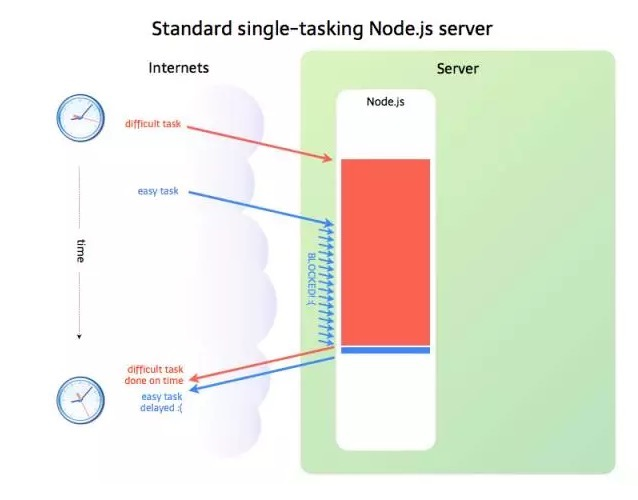

### NODE单线程


- 这个图是整个Node.js的运行原理，从左到右，从上到下，Node.js被分成了四层，分别是应用层、V8引擎层、Node API层 和 LIBUV层，  
  应用层： 即Javascript交互层，常见的就是Node.js的模块，比如 http，fs  
  V8引擎层： 即利用V8引擎来解析Javascript语法，进而和下层API交互  
  NodeAPI层： 为上层模块提供系统调用，一般是由C语言来实现，和操作系统进行交互  
  LIBUV层： 即Event Loop，是Node.js实现异步的核心，由LIBUV库来实现，而LIBUV中的线程池是由操作系统内核接受管理的。  

- 注：LIBUV 是一个高性能事件驱动的程序库，封装了 Windows 和 Unix 平台一些底层特性，为开发者提供了统一的 API  


- 【1】事件队列  
首先，我们需要定义一个事件队列，既然是队列，那就是一个先进先出(FIFO)的数据结构，我们用JS的数组来描述，如下：  

* 定义事件队列  
* 入队：unshfit()  
* 出队：pop()  
* 空队列：length == 0  

```
eventQueue:[],
```

- 为了方便理解，我们规定：数组的第一个元素是队列的尾部，数组的最后一个元素是队列的头部， unshfit 就是在尾部插入一个元素，pop就是从头部弹出一个元素，这样就实现了一个简单的队列   
 
- 【2】接收请求
   定义一个总的入口来接收用户请求，如下所示：  

* 接收用户请求  
* 每一个请求都会进入到该函数  
* 传递参数request和response  

```
  processHttpRequest:function(request,response){
    var event = createEvent({
      params:request.params, // 传递请求参数
      result:null, //存放请求结果
      callback:function(){} //指定回调函数
    })


    //在队列的尾部添加改事件
    eventQueue.unshift(event);
  },


```

- 【3】事件循环 ( Event Loop )  
当主线程处于空闲时就开始循环事件队列，所以，我们再定义一个事件循环的函数：  

* 事件循环主体，主线程择机执行  
* 循环遍历事件队列  
* 处理事件  
* 执行回调，返回给上层  

```
eventLoop:function(){
  //如果队列不为空，就继续循环
  while(this.eventQueue.length > 0 ){
    var event = this.eventQueue.pop();//重队列的头部拿出一个事件

    //如果是i/o任务
    if(isIOTask(event)){
      var thread = getThreadFromThreadPool();//从线程池中拿出一个线程
      thread.handleIOTask(event)//交给线程处理
    }else{

      var result = handleEvent(event);  //非i/o任务处理后直接返回结果

      //最终通过回调函数返回给V8,在由v8返回给程序
      event.callback.call(null,result);
    }
  }
}
```


- 【4】线程池  
线程池接到任务以后，直接处理IO操作，比如读取数据库：  

* 处理IO任务  
* 完成后将事件添加到队列尾部  
* 释放线程  

```
handleIOTask:function(event){
  //当前线程
  var curThread = this;

  //操作数据库

  var optDatabase = function(params,callback){
    var result = readDataFromDb(params);
    callback.call(null,result)
  }

  //执行i/o任务

  optDatabase(event.params,function(result){
    // 返回结果存入事件对象中
    event.result = result;

    //I/O玩抽，价格不再是耗时任务
    event.isIOTask = false;

    //将该事件重新添加到队列的尾部

    this.eventQueue.unshift(event);

    //释放当前线程
    releaseThread(curThread)
  })
}
```


- 总结以上过程我们发现，Node.js    的主线程就是一个单线程，它接收请求后并没有直接做处理，而是放到了事件队列中，然后去接收其他请求了，空闲时再通过Event Loop来处理这些事件，从而实现了异步效果，当然对于IO类任务还要依赖于系统层面的线程池来处理。因此，我们可以简单理解为：Node.js本身是一个多线程平台，而它对JS层面的任务处理是单线程。  


- 至此，我们对Node.js应该有了一个简单而又清晰的认识，但Node.js 并不是什么都能做。  


- 上面提到，如果是I/O任务，Nodejs就把任务交给线程池来异步处理，高效简单，因此Node.js适合处理I/O密集型任务，但不是所有的任务都是I/O密集型任务，当碰到CPU密集型任务时，就是只用CPU计算的操作，比如要对数据加解密(node.bcrypt.js)，数据压缩和解压(node-tar)，这时Node.js就会亲自处理，一个一个的计算，前面的任务没有执行完，后面的任务只能干等着，如下图所示：  



- 在事件队列中，如果前面的CPU计算任务没有完成，那么后面的任务就会被阻塞，出现响应缓慢的情况，如果操作系统本身就是单核，那也就算了，但现在大部分服务器都是多CPU或多核的，而Node.js只有一个EventLoop，也只占用一个CPU/内核，当Node.js被CPU密集型任务占用，导致其他任务被阻塞时，却还有CPU/内核处理闲置状态，造成资源浪费。因此Node.js并不适合CPU密集型任务.  


- Node.js适用场景

- RESTful API，这是适合 Node 的理想情况，因为您可以构建它来处理数万条连接。它仍然不需要大量逻辑；它本质上只是从某个数据库中查找一些值并将它们组成一个响应。由于响应是少量文本，入站请求也是少量的文本，因此流量不高，一台机器甚至也可以处理最繁忙的公司的 API 需求。  
 
- 实时程序，比如聊天服务，聊天应用程序是最能体现 Node.js 优点的例子：轻量级、高流量并且能良好的应对跨平台设备上运行密集型数据（虽然计算能力低）。同时，聊天也是一个非常值得学习的用例，因为它很简单，并且涵盖了目前为止一个典型的 Node.js 会用到的大部分解决方案。  
